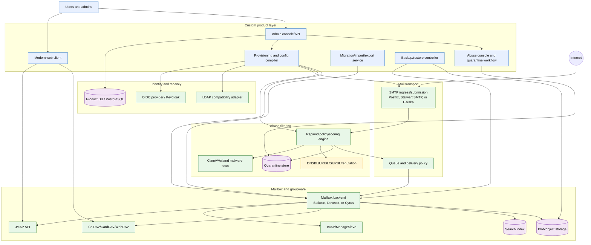

# Open Mailgroupware: FOSS-First Architecture Docs

This documentation set sketches a greenfield alternative to Zimbra-style mail and workgroupware.

The core thesis is simple:

> Build the product, control plane, abuse-management workflow, and UX from scratch. Glue proven open-source mail, identity, filtering, storage, and protocol components underneath.

These docs are intentionally written as **Mermaid-first Markdown** so they can live directly in a GitHub repository, render in GitHub/GitLab, and evolve into architecture decision records.

## Document index

| Doc | Purpose |
|---|---|
| [`01-component-catalog.md`](./docs/01-component-catalog.md) | FOSS/custom/commercial component map and replacement choices. |
| [`02-greenfield-architecture.md`](./docs/02-greenfield-architecture.md) | System architecture, deployment boundaries, service graph, multi-tenancy, HA/DR, operational model, protocol coverage, performance targets. |
| [`03-abuse-pipeline.md`](./docs/03-abuse-pipeline.md) | Spam, phishing, malware, quarantine, feedback loop, threat intelligence, DMARC reporting, shadow-copy, and digest design. |
| [`04-domain-model-erd.md`](./docs/04-domain-model-erd.md) | Core entity relationship model: tenants, users, mailboxes, messages, policies, quarantine, audit, delivery, sessions, DMARC, threat intel. |
| [`05-build-roadmap.md`](./docs/05-build-roadmap.md) | MVP sequencing, build/buy/glue boundaries, parallel spikes, ADRs, and success criteria. |
| [`06-design-audit.md`](./docs/06-design-audit.md) | Gap analysis of original design across 11 categories — 4 P0s, 25 P1s, 28 P2s, 3 P3s. |
| [`07-multi-tenancy-isolation.md`](./docs/07-multi-tenancy-isolation.md) | Multi-tenant isolation model: RLS, schema-per-tenant, Redis/S3/search prefix isolation, tenant lifecycle, quotas, data residency. |
| [`08-security-model.md`](./docs/08-security-model.md) | Authentication (OIDC, app passwords, OAuth2, mTLS), MFA policy, session management, API auth, TLS, secrets management, audit logging, incident response. |
| [`09-kubernetes-deployment.md`](./docs/09-kubernetes-deployment.md) | K8s deployment architecture: three scaling phases (single-node → multi-node → multi-region), per-component sharding strategies, config compiler operator, HPA/VPA, node pools, backup/DR, monitoring. |
| [`10-foss-component-audit.md`](./docs/10-foss-component-audit.md) | FOSS component evaluation for all 14 components — 8-criteria scoring (operational simplicity, protocol coverage, extensibility, backup, search, groupware maturity, abuse integration, multi-tenancy). Track A vs Track B comparison. |
| [`11-deployment-plan.md`](./docs/11-deployment-plan.md) | Build/deploy loop for the product services (helm + kustomize). |
| [`12-external-services-deployment.md`](./docs/12-external-services-deployment.md) | Wrapped infrastructure deployment (Stalwart, Rspamd, PG, Redis, MinIO, observability). |
| [`13-ownership-review.md`](./docs/13-ownership-review.md) | **Binding decision log.** Opinionated review of docs 01–12 + code; where it conflicts with other docs, doc 13 wins. Key decisions: control-plane-only DB (ADR-0005), sesame-idam identity (ADR-0006 v2), Track B removed, RLS fixes, scope cuts. |

## Architecture stance

This is **not** a Zimbra fork.

It is a new product layer on top of replaceable FOSS infrastructure:

- SMTP transport
- IMAP/JMAP mailbox access
- CalDAV/CardDAV groupware
- Rspamd-driven abuse filtering
- ClamAV malware scanning
- OIDC/LDAP identity integration
- object/file storage
- backup/restore orchestration
- admin and end-user UX

## Top-level component graph

## Initial opinionated implementation choice

For the first technical spike, evaluate two tracks:

1. **Integrated backend track**: Stalwart as the mail/collaboration backend, with the custom product/control plane built around it.
2. **Composable Unix mail track**: Postfix + Rspamd + ClamAV + Dovecot/Cyrus + DAV stack + custom product/control plane.

The project should avoid rewriting SMTP, IMAP, virus scanning, spam scoring, and basic identity plumbing unless there is a very specific strategic reason.

