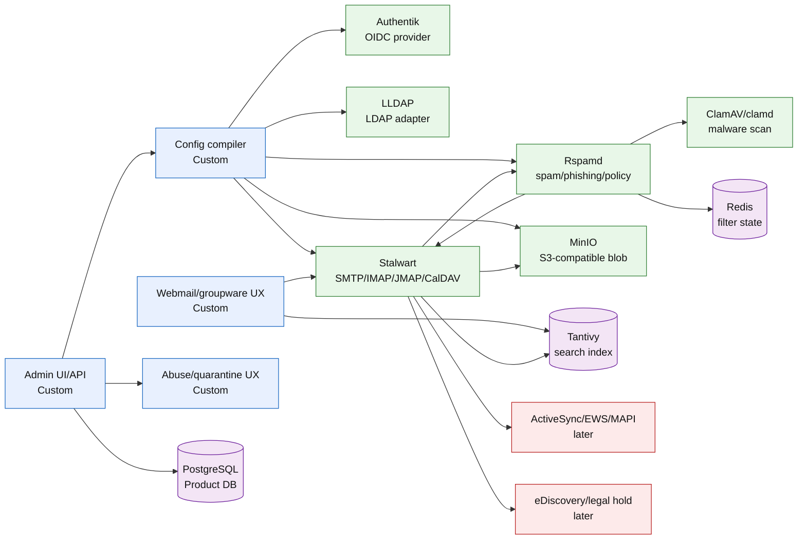
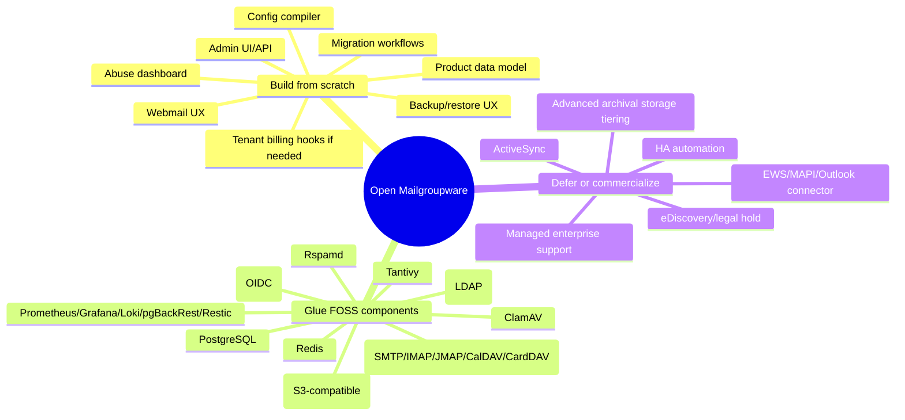
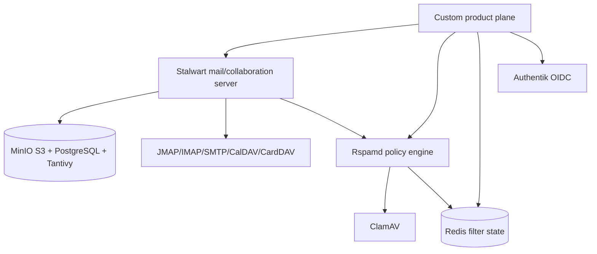

# 01 — Component Catalog

This document maps the main components needed for a greenfield Zimbra-like alternative.

Labels:

- **FOSS commodity**: use as-is or lightly configure.
- **Custom product**: should be built from scratch because this is where the product differentiation lives.
- **Optional commercial**: defer until the FOSS/product core works.
- **Replaceable**: select one implementation, but keep the boundary abstract.

## Component status map

| Layer | Component | Implementation | Label | Notes |
|---|---|---|---|---|
| Admin/control plane | Admin UI/API | Custom app | Custom product | Domain, user, policy, queue, abuse, backup, and migration surface. |
| Provisioning | Config compiler | Custom service | Custom product | Converts product model into Stalwart/Rspamd config. |
| Web UX | Webmail/calendar/contacts | Custom web app | Custom product | Product-defining experience. Do not copy legacy Zimbra UX. |
| Identity | OIDC | Authentik | FOSS/replaceable | SaaS-native multi-tenancy. |
| Directory compatibility | LDAP | LLDAP | FOSS/replaceable | Lightweight Rust LDAP server. |
| SMTP ingress | MTA | Stalwart SMTP | FOSS/commodity | Track A integrated backend. |
| Abuse engine | Spam/phishing scoring | Rspamd | FOSS/commodity | Multi-tenant capable via Redis key prefixing. |
| Malware scan | AV daemon | ClamAV/clamd | FOSS/commodity | Stateless — no multi-tenant concerns. |
| Policy state | Cache/state | Redis | FOSS/commodity | ACL-based key prefixing for tenant isolation. |
| Mailbox | Store/backend | Stalwart | FOSS/commodity | Track A integrated backend — IMAP, JMAP, CalDAV, CardDAV all included. |
| Filters | Sieve/ManageSieve | Stalwart Sieve | FOSS/commodity | Tenant-isolated via parent backend. |
| Calendar | CalDAV/JMAP Calendar | Stalwart | FOSS/commodity | Built into Stalwart stack. |
| Contacts | CardDAV/JMAP Contacts | Stalwart | FOSS/commodity | Built into Stalwart stack. |
| Search | Search engine | Tantivy | FOSS/commodity | Embedded Rust library — no separate service. Tenant-scoped index files. |
| Blob storage | Message/attachment storage | MinIO | FOSS/commodity | S3-compatible. Prefix + IAM for tenant isolation. |
| Product DB | Metadata/control DB | PostgreSQL | FOSS/commodity | RLS for tenant isolation. |
| Observability | Metrics/logs/traces | Prometheus, Grafana, Loki, OpenTelemetry | FOSS/commodity | Required for serious operations. |
| Backup | Backup/restore | pgBackRest + Restic | FOSS/custom | Per-tenant schema restore via pgBackRest; blob via Restic. |
| Migration | Import/export | imapsync + custom orchestrator | FOSS/custom | IMAP-based migration with checkpoint/resume. |
| Mobile enterprise | ActiveSync/EAS | Defer | Defer | IMAP + CalDAV/CardDAV first. |
| Outlook enterprise | EWS/MAPI | Defer | Defer | Huge compatibility sink. |
| Compliance | Legal hold/eDiscovery | Defer | Defer | Defer until core is reliable. |
|| DMARC reporting | Aggregate/forensic reports | Rspamd + custom receiver service | FOSS/commercial | Receive and store DMARC reports for deliverability analysis. |
|| DMARC auto-remediation | Auto-apply DMARC policy | Rspamd policy integration | FOSS commodity | Reject/quarantine based on DMARC fail — no manual config needed. |
|| Outbound shadow-copy | Enterprise security BCC | Custom service or Rspamd BCC | FOSS/commercial | Shadow-copy outbound messages for security audit. |
|| Threat intelligence | Blocklists, feed integration | Custom service + threat intel sources | FOSS/commercial | Store and apply threat intel to abuse pipeline. |
|| Quarantine digest | Daily/weekly user notifications | Custom notification service | FOSS/custom | Users receive digest of quarantined messages. |

## Component dependency graph

## Build/glue/buy boundaries

## Selected stack (Track A + K8s)

Stalwart is the integrated backend — it provides SMTP, IMAP, JMAP, CalDAV,
CardDAV, and Sieve in a single Rust codebase with native multi-tenancy. The
custom product plane sits above it: admin API, config compiler, web UI, abuse
console, migration tool, and backup controller. All infrastructure (Stalwart,
Rspamd, ClamAV, Redis, MinIO, PostgreSQL, Authentik, Tantivy) is deployed via
Helm charts in Kubernetes, managed with GitOps (ArgoCD or Flux).

Track B (Postfix/Dovecot) remains documented for reference but is superseded
by Track A for the reasons in the component audit.

