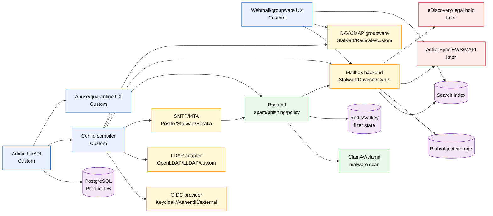
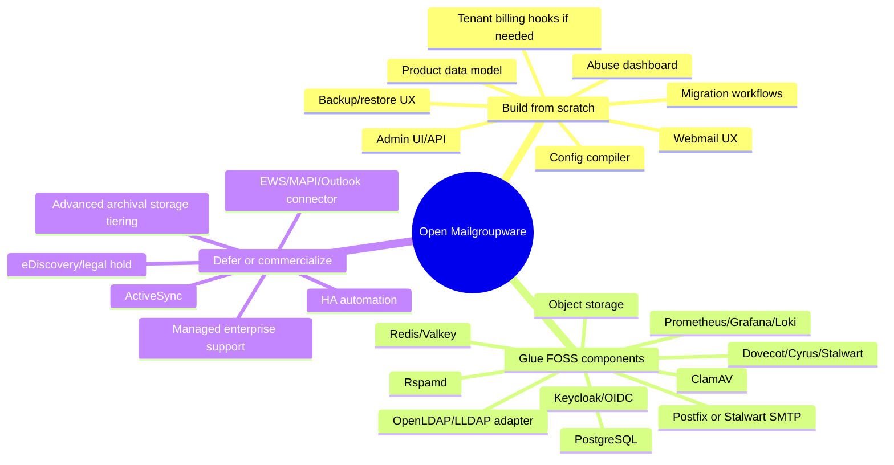
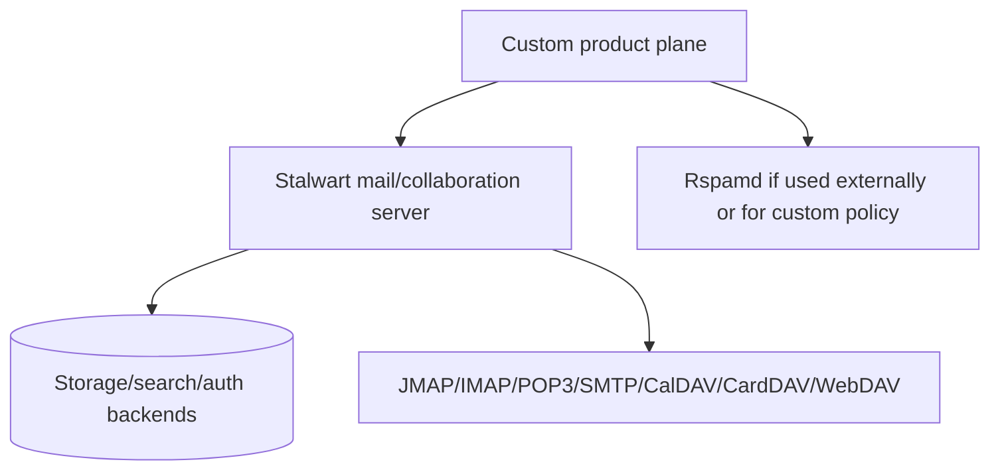
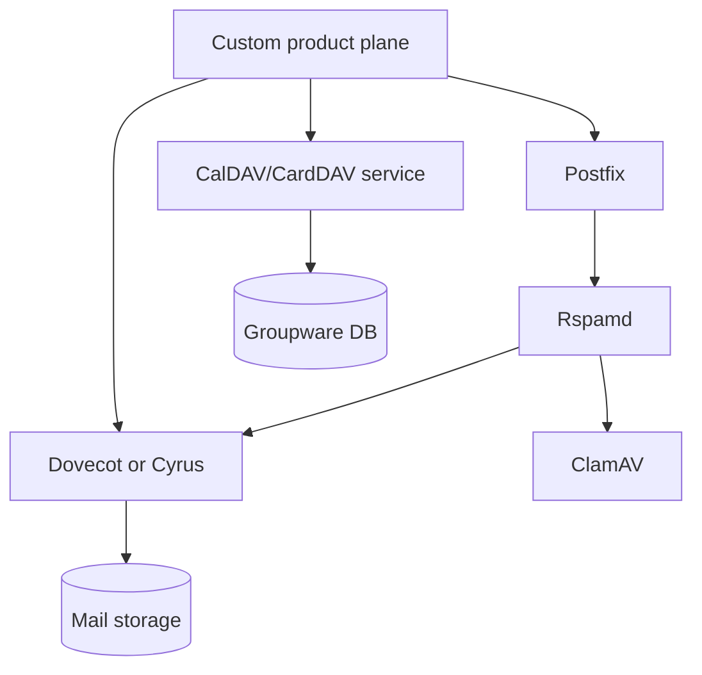

# 01 — Component Catalog

This document maps the main components needed for a greenfield Zimbra-like alternative.

Labels:

- **FOSS commodity**: use as-is or lightly configure.
- **Custom product**: should be built from scratch because this is where the product differentiation lives.
- **Optional commercial**: defer until the FOSS/product core works.
- **Replaceable**: select one implementation, but keep the boundary abstract.

## Component status map

| Layer | Component | Candidate implementation | Label | Notes |
|---|---|---|---|---|
| Admin/control plane | Admin UI/API | Custom app | Custom product | Domain, user, policy, queue, abuse, backup, and migration surface. |
| Provisioning | Config compiler | Custom service | Custom product | Converts product model into Postfix/Rspamd/Dovecot/Stalwart/etc. config. |
| Web UX | Webmail/calendar/contacts | Custom web app | Custom product | Product-defining experience. Do not copy legacy Zimbra UX. |
| Identity | OIDC | Keycloak, Authentik, Zitadel CE, external IdP | FOSS/replaceable | Prefer OIDC-first; keep LDAP compatibility for mail components. |
| Directory compatibility | LDAP | OpenLDAP, LLDAP, custom read-only LDAP adapter | FOSS/replaceable | Useful for legacy components and enterprise integrations. |
| SMTP ingress | MTA | Postfix, Stalwart SMTP, Haraka, OpenSMTPD | FOSS/replaceable | Do not rewrite early. |
| SMTP submission | MSA | Postfix or Stalwart SMTP | FOSS/replaceable | Needs auth, rate limits, outbound abuse controls. |
| Abuse engine | Spam/phishing scoring | Rspamd | FOSS commodity | Best default center of gravity for policy/scoring. |
| Malware scan | AV daemon | ClamAV/clamd | FOSS commodity | Integrate through Rspamd or MTA filter path. |
| Policy state | Cache/state | Redis or Valkey | FOSS commodity | Rspamd state, rate limits, greylisting, reputation. |
| Mailbox | Store/backend | Stalwart, Dovecot, Cyrus | FOSS/replaceable | Biggest architecture decision. |
| Mail client protocol | IMAP | Dovecot/Cyrus/Stalwart | FOSS commodity | Required for broad compatibility. |
| Modern app protocol | JMAP | Stalwart or dedicated gateway | FOSS/replaceable | Better basis for a modern web app than IMAP. |
| Filters | Sieve/ManageSieve | Dovecot/Cyrus/Stalwart Sieve | FOSS commodity | User mail rules and server-side filtering. |
| Calendar | CalDAV/JMAP Calendar | Stalwart, Radicale, DAViCal, SabreDAV, custom | FOSS/replaceable | Needs scheduling, invites, free/busy, sharing. |
| Contacts | CardDAV/JMAP Contacts | Stalwart, Radicale, SabreDAV, custom | FOSS/replaceable | Needs address books, GAL, sharing. |
| Search | Search engine | backend-native, OpenSearch, Xapian, Tantivy, Meilisearch | FOSS/replaceable | Keep indexing boundary isolated. |
| Blob storage | Message/attachment storage | filesystem, S3-compatible object store | FOSS/replaceable | Design for S3-compatible storage from the start. |
| Product DB | Metadata/control DB | PostgreSQL | FOSS commodity | Tenants, domains, policies, jobs, audit, quarantine metadata. |
| Observability | Metrics/logs/traces | Prometheus, Grafana, Loki, OpenTelemetry | FOSS commodity | Required for serious operations. |
| Backup | Backup/restore | Restic/Borg/snapshots/custom orchestrator | FOSS/custom | Productize restore flows early. |
| Migration | Import/export | imapsync, custom Zimbra TGZ parser, DAV import | FOSS/custom | Critical wedge for adoption. |
| Mobile enterprise | ActiveSync/EAS | z-push, commercial bridge, custom later | Optional commercial | Defer. IMAP + CalDAV/CardDAV first. |
| Outlook enterprise | EWS/MAPI | commercial bridge/custom later | Optional commercial | Defer. Huge compatibility sink. |
| Compliance | Legal hold/eDiscovery | custom archive service later | Optional commercial | Defer until core is reliable. |
|| DMARC reporting | Aggregate/forensic reports | Rspamd + custom receiver service | FOSS/commercial | Receive and store DMARC reports for deliverability analysis. |
|| DMARC auto-remediation | Auto-apply DMARC policy | Rspamd policy integration | FOSS commodity | Reject/quarantine based on DMARC fail — no manual config needed. |
|| Outbound shadow-copy | Enterprise security BCC | Custom service or Rspamd BCC | FOSS/commercial | Shadow-copy outbound messages for security audit. |
|| Threat intelligence | Blocklists, feed integration | Custom service + threat intel sources | FOSS/commercial | Store and apply threat intel to abuse pipeline. |
|| Quarantine digest | Daily/weekly user notifications | Custom notification service | FOSS/custom | Users receive digest of quarantined messages. |

## Component dependency graph

## Build/glue/buy boundaries

## Recommended candidate stacks

### Track A — Integrated backend

Best when the priority is a modern backend and fewer moving parts.

### Track B — Composable Unix stack

Best when the priority is conservative components, operational familiarity, and easy replacement of individual services.

