# 02 — Greenfield Architecture

This is the proposed system architecture for a from-scratch open mailgroupware platform built by gluing FOSS components.

## Architectural principles

1. **Protocol-first**: SMTP, IMAP, JMAP, CalDAV, CardDAV, WebDAV, OIDC, LDAP compatibility.
2. **Replaceable infrastructure**: no component should be impossible to swap.
3. **Product-owned control plane**: the admin model, policy model, abuse workflow, migration, backup, and UX are custom.
4. **Abuse-first delivery**: mail must pass through scoring, authentication, malware scanning, URL checks, and policy before final mailbox delivery.
5. **Restore-first operations**: if backup/restore is not built early, the platform is not production-ready.

## C4-style context diagram

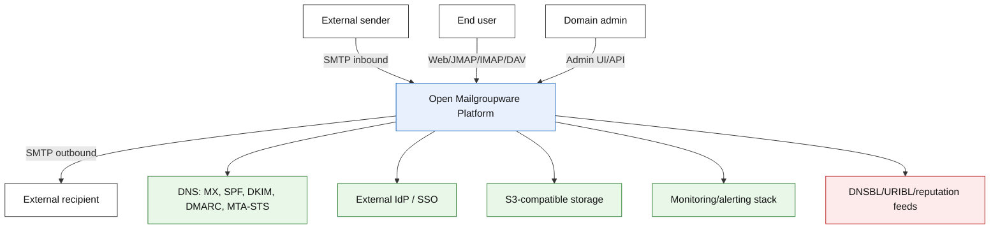

## Container/service diagram

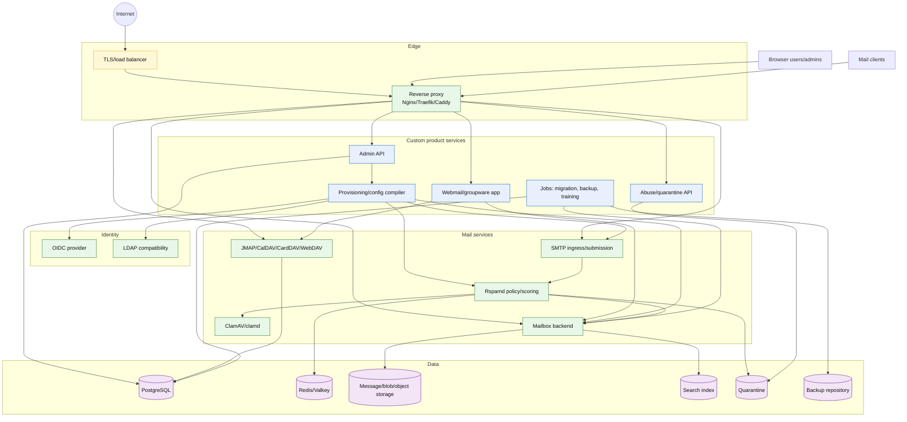

## Inbound mail delivery sequence

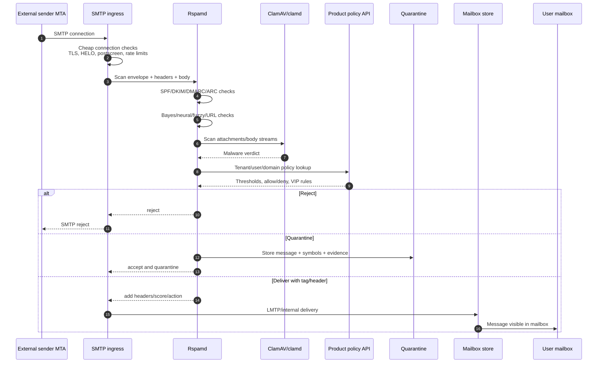

## Outbound mail sequence

Outbound filtering matters as much as inbound filtering. A compromised mailbox can destroy domain reputation quickly.

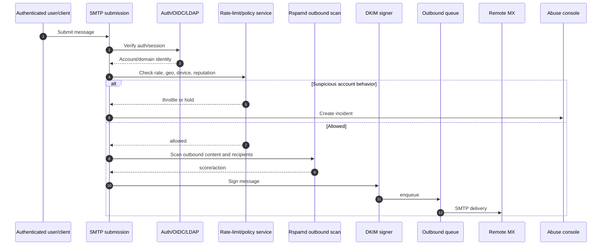

## Control plane flow

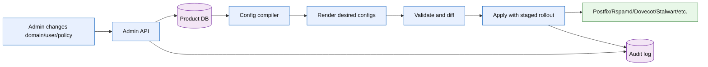

## Configuration ownership model

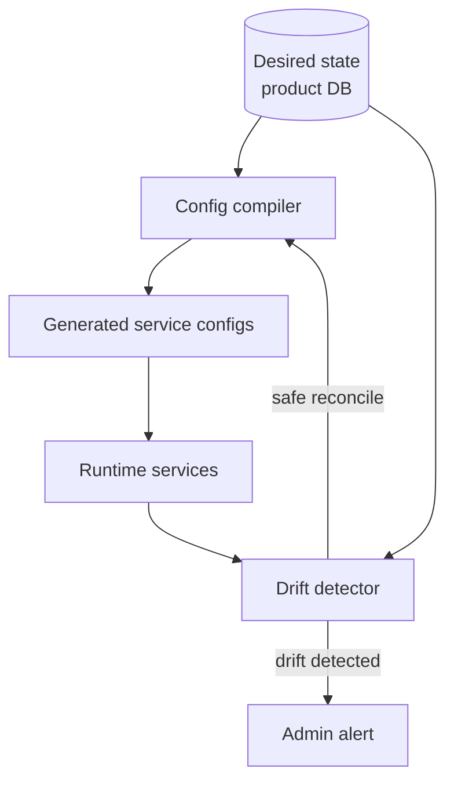

The platform should avoid hand-edited production configs. Admin changes should produce desired state; the compiler renders service-specific configs; drift detection tells the operator when reality diverges.

## Deployment shapes

### Single-node MVP

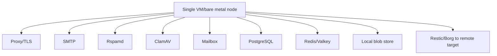

### Small cluster

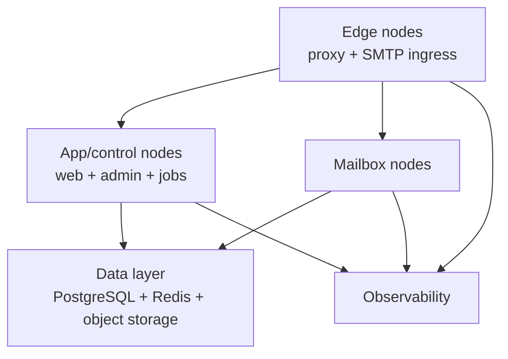

### Enterprise later

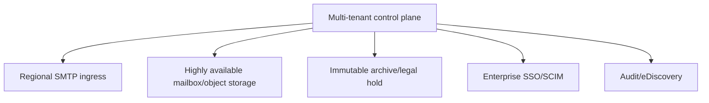

## Multi-tenancy isolation model

All tenants share PostgreSQL, Redis, blob storage, and search index. Isolation is
enforced at the application layer via **tenant-scoped queries** and **row-level
security (RLS)** on PostgreSQL.

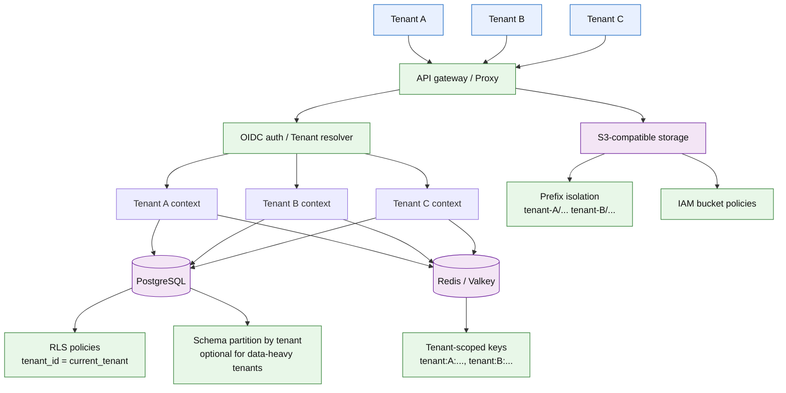

### Isolation layers

| Layer | Mechanism | Enforced by |
|-------|-----------|-------------|
| Query isolation | `tenant_id` FK on every row, RLS on PostgreSQL | Product DB + RLS policies |
| Cache isolation | Redis keys prefixed by tenant (`tenant:{id}:...`) | Config compiler |
| Storage isolation | S3 prefixes (`tenant-{id}/`) + IAM policies | Blob backend |
| Search isolation | Tenant-scoped search index partitions | Config compiler |
| SMTP isolation | Per-tenant connection limits, queue partitioning | MTA config |
| Resource quotas | `TENANT_RESOURCE_QUOTA` enforced at API layer | Admin API |

### Tenant lifecycle

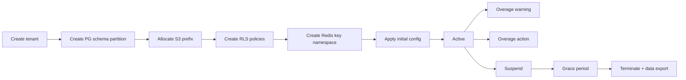

### Policy

- Default: single PostgreSQL database with RLS on all tenant-scoped tables.
- Data-heavy tenants (10K+ accounts): schema-per-tenant optional via config compiler.
- Redis: keyspace isolation via prefix convention + config compiler enforced at write time.
- S3: one bucket, prefix-based isolation with per-tenant IAM policies (future).
- Search: tenant-scoped queries with index-level filtering (no cross-tenant visibility).

## High availability and disaster recovery

### RPO/RTO targets

| Component | RPO | RTO | Strategy |
|-----------|-----|-----|----------|
| Product DB (PostgreSQL) | 1 min | 30s | Streaming replication + automated failover |
| Redis/Valkey | 0 loss | 60s | Redis Sentinel or Redis Cluster |
| Mailbox backend | 5 min | 5 min | Shared storage or hot standby |
| Blob/object storage | 15 min | 15 min | S3 cross-region replication |
| Search index | 5 min | 10 min | Near-real-time replication |

### Small cluster — with HA

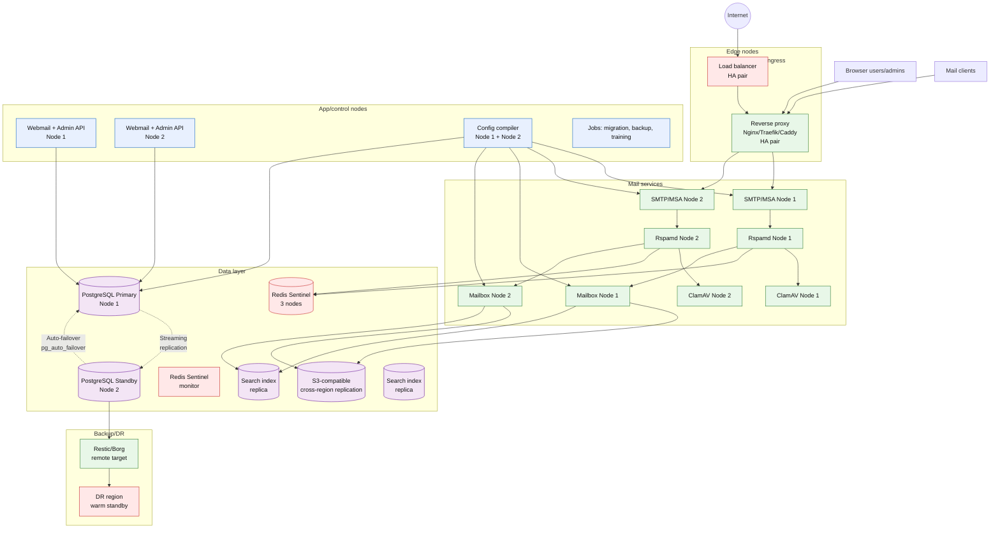

### Upgrade strategy

- Config compiler supports **staged rollout**: renders configs for one node at a time,
  validates health, then proceeds to next.
- Rolling restart of mail services: SMTP → Rspamd → Mailbox (in order).
- PostgreSQL failover tested quarterly; runbook stored with DR region.

## Operational model

### Health checks

Every service exposes `/health` (liveness) and `/ready` (readiness) endpoints.
Liveness = process is alive; readiness = dependencies (DB, cache, downstream
services) are responsive. Load balancer uses readiness to drain traffic before
shutdown.

### Logging and tracing

All services log structured JSON with correlation IDs (X-Correlation-Id header
propagated through the stack). OpenTelemetry trace context embedded in logs.
Log aggregation: Loki + Promtail or OpenTelemetry collector → Loki.

### Configuration schema validation

The config compiler validates against **JSON Schema definitions** for each service
(Postfix, Rspamd, Dovecot, Stalwart). Before applying a new config:

1. Compiler renders desired-state → generated config
2. JSON Schema validator checks structural correctness
3. Dry-run validation against live service (syntax check)
4. If validation passes: apply to target node(s) in staged order
5. Post-apply health check confirms service is accepting traffic

### Secrets management

| Secret type | Storage | Rotation |
|-------------|---------|----------|
| PostgreSQL passwords | HashiCorp Vault / SSM Parameter Store | Config compiler injects at runtime |
| DKIM private keys | Vault / Kubernetes Secrets | Quarterly + domain transfer |
| SMTP submission auth | LDAP/OIDC (external) | N/A |
| TLS certificates | ACME (Let's Encrypt) / Vault | Auto-renewal every 90 days |
| API keys (admin) | Vault / Kubernetes Secrets | On-rotate, 90-day expiry |
| Rspamd secrets | Vault / env vars (K8s) | Quarterly |

### Internal service-to-service auth

mTLS with mutual certificate exchange between services. Each service has a
service identity certificate. Internal API calls require valid mTLS client cert.
Config compiler provisions certificates to each service at bootstrap.

## Protocol coverage

### Required (MVP)

| Protocol | Purpose | Implementation |
|----------|---------|----------------|
| SMTP (ESMTP) | Ingress/submission | Postfix / Stalwart |
| SMTPUTF8 | RFC 6531 — non-ASCII addresses | Enabled at MTA level |
| IMAP4rev1 | Mail access | Dovecot / Stalwart |
| IMAP IDLE | Push notification (real-time) | Backend-implemented |
| JMAP | Modern web app API | Stalwart or dedicated gateway |
| CalDAV | Calendar | Stalwart / Radicale |
| CardDAV | Contacts | Stalwart / Radicale |
| WebDAV | Files/documents | Stalwart / Radicale |
| ManageSieve | User-side rules | Dovecot / Stalwart |
| OIDC | Authentication | Keycloak / Authentik |

### Should have (post-MVP)

| Protocol | Purpose | Notes |
|----------|---------|-------|
| POP3 | Archival clients | Low demand but standard |
| S/MIME | Message-level encryption | Client + server certificate store |
| PGP/MIME | Message-level encryption | OpenPGP integration |
| IMAP MOVE / UIDPLUS | Efficient client sync | Dovecot supports natively |
| IMAP QRESYNC | Fast reconnection sync | Reduces bandwidth |
| SMTP 8BITMIME | Binary attachments | Required by RFC 6152 |
| EAI / SMTPUTF8 | Full RFC 6531 compliance | Non-ASCII addresses |
| JMAP Push | Real-time webmail updates | JMAP-native push |
| OAuth 2.0 / PKCE | Third-party app auth | For web API integrations |

### Deferred

| Protocol | Purpose | Notes |
|----------|---------|-------|
| ActiveSync (EAS) | Mobile enterprise | Defer to IMAP+CalDAV first |
| EWS / MAPI | Outlook connector | Huge compatibility sink |
| XMPP / Chat | Real-time messaging | Out of scope for MVP |
| WebRTC / Video | Video calling | Third-party integration |

### Webmail push strategy

If using JMAP: JMAP Push is native (server-initiated events).
If using IMAP: IMAP IDLE from backend → Server-Sent Events (SSE) or WebSocket
to browser. JMAP Push preferred for new development.

## Performance targets

| Metric | Target | Notes |
|--------|--------|-------|
| SMTP throughput | 10K msg/min per node | Sustained, peak 2x |
| Concurrent SMTP connections | 5K per node | Rate-limited by config compiler |
| IMAP concurrent connections | 10K per node | Per mailbox backend |
| Search latency | < 200ms p95 | Per-tenant index |
| API response time | < 500ms p95 | Admin API |
| Webmail load time | < 2s first paint | With 10K messages |
| Backup restore | 100GB/hour | Per backup repository |

### Connection pooling

PostgreSQL connections use **PgBouncer** in transaction pooling mode. Admin API
and config compiler connect via PgBouncer pool (max 500 connections per primary).
Read replicas use separate PgBouncer pools for read-heavy admin queries.

