# 03 — Abuse Pipeline: Spam, Phishing, Malware, and Quarantine

This is the most important subsystem after identity and mailbox storage.

A modern mailgroupware platform should treat abuse filtering as a first-class workflow, not as a hidden daemon that occasionally adds `X-Spam` headers.

## Goals

- Reject obvious abusive traffic before accepting responsibility for the message.
- Score ambiguous mail with explainable evidence.
- Quarantine suspicious mail in a product-owned workflow.
- Feed user/admin decisions back into training.
- Protect outbound reputation from compromised accounts.
- Give domain admins policy control without forcing them to edit low-level Rspamd/Postfix config.

## Abuse architecture

```mermaid
flowchart TB
  classDef ingress fill:#fff7d6,stroke:#f9a825,color:#111
  classDef engine fill:#e8f7e8,stroke:#2e7d32,color:#111
  classDef product fill:#e8f0fe,stroke:#1565c0,color:#111
  classDef data fill:#f3e5f5,stroke:#6a1b9a,color:#111
  classDef risk fill:#fdeaea,stroke:#b71c1c,color:#111

  SMTP[SMTP ingress/submission]:::ingress
  Rspamd[Rspamd scoring engine]:::engine
  ClamAV[ClamAV/clamd]:::engine
  Redis[(Redis/Valkey state)]:::data
  Reputation[DNSBL/URIBL/SURBL/reputation]:::risk
  Fuzzy[Fuzzy hashes/campaign detection]:::engine
  URL[URL and attachment analysis]:::engine
  PolicyAPI[Product policy API]:::product
  Quarantine[(Quarantine store)]:::data
  AbuseUI[Abuse console]:::product
  Mailbox[Mailbox store]:::engine
  Training[Training/feedback jobs]:::product
  Metrics[(Metrics/audit log)]:::data
  DMARCReceiver[DMARC report receiver]:::product
  ThreatIntel[Threat intelligence store]:::data
  ShadowCopy[Outbound shadow-copy service]:::product
  SecurityMailbox[(Security mailbox)]:::data
  QuarantineDigest[Quarantine digest service]:::product
  UserNotification[(User notification store)]:::data

  SMTP --> Rspamd
  Rspamd --> ClamAV
  Rspamd --> Redis
  Rspamd --> Reputation
  Rspamd --> Fuzzy
  Rspamd --> URL
  Rspamd --> PolicyAPI
  Rspamd --> Quarantine
  Rspamd --> Mailbox
  Rspamd --> Metrics
  Rspamd --> DMARCReceiver

  DMARCReceiver --> DMARCReport[DMARC report DB]:::data
  DMARCReport --> DMARCAutoRemediate[DMARC auto-remediation<br/>reject/quarantine on fail]:::engine

  Reputation --> ThreatIntel
  ThreatIntel --> Rspamd

  AbuseUI --> Quarantine
  AbuseUI --> PolicyAPI
  AbuseUI --> Training
  Training --> Rspamd
  Training --> Metrics

  QuarantineDigest --> Quarantine
  QuarantineDigest --> UserNotification
  UserNotification --> UserEmail[Daily/weekly digest email]

  SMTP -->|outbound| OutboundSubmit[SMTP submission]:::ingress
  OutboundSubmit --> OutboundScan[Outbound Rspamd scan]:::engine
  OutboundScan --> ShadowCopy
  ShadowCopy --> SecurityMailbox
  OutboundSubmit --> DKIM[DKIM signer]:::engine
  DKIM --> Queue[Outbound queue]:::engine
  Queue --> RemoteMX[Remote MX]:::risk
```

### Threat intelligence integration

Threat intel feeds are consumed and stored in `THREAT_INTEL_OBSERVATION`. The
abuse pipeline checks threat intel at three points:

1. **SMTP connection**: IP reputation check against blocklists
2. **Content scan**: URL domains and sender domains against threat feeds
3. **Policy evaluation**: VIP/supplier domains against lookalike detection

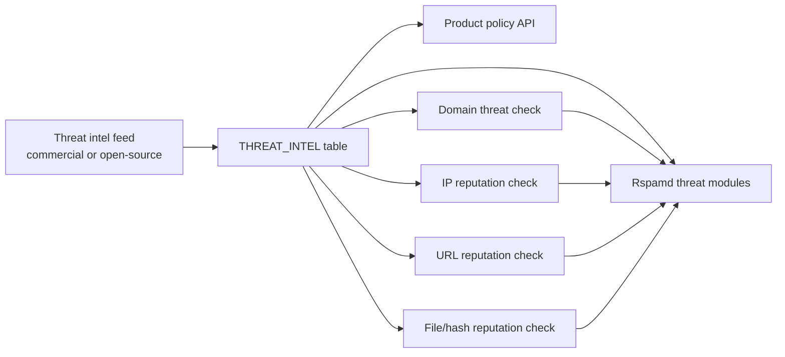

### DMARC reporting

DMARC aggregate and forensic reports are received, parsed, and stored:

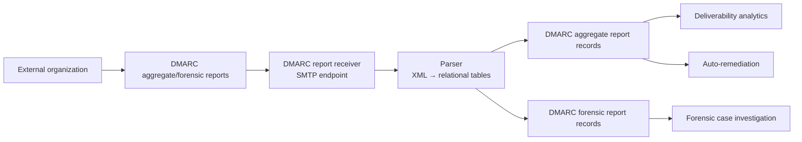

DMARC auto-remediation:
- SPF fail + DKIM fail → reject or quarantine (configurable)
- DMARC policy = reject → automatic reject
- DMARC policy = quarantine → automatic quarantine
- DMARC policy = none → score-only (no auto-action)

### Outbound shadow-copy

Shadow-copying sends a BCC of every outbound message to a security mailbox for
compliance and security audit:

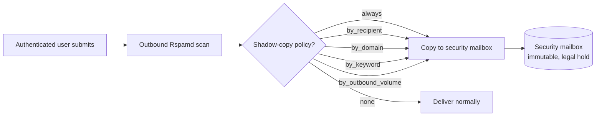

Shadow-copy policies (configurable per tenant):
- `always` — shadow every outbound message
- `by_recipient` — shadow when recipient is external
- `by_domain` — shadow when recipient matches blocked TLD list
- `by_keyword` — shadow when body contains credential/payment keywords
- `by_outbound_volume` — shadow when user exceeds daily outbound threshold

### Quarantine digest

Users receive periodic digests of quarantined messages:

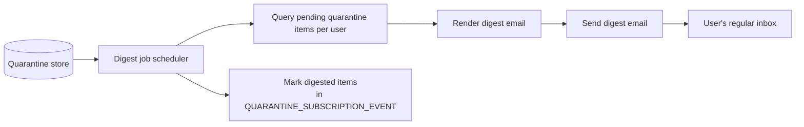

Digest frequency: `daily`, `weekly`, or `immediate` (real-time notification).
Digest includes: message preview, sender, subject, spam score, action buttons
(release, delete, mark as spam/ham).

## Inbound classification decision tree

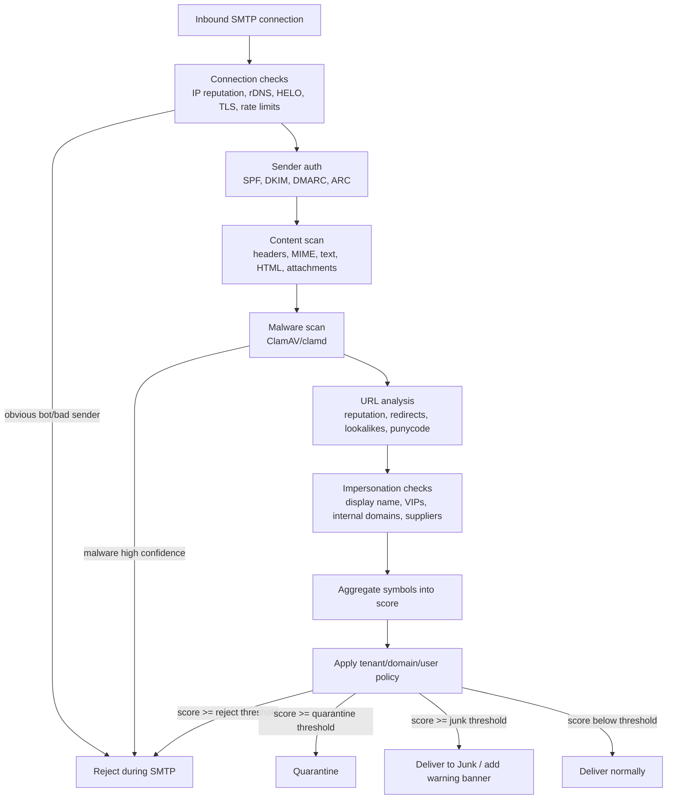

## Scoring symbol model

The product should not expose raw Rspamd internals to normal admins, but it should retain symbol evidence for explainability.

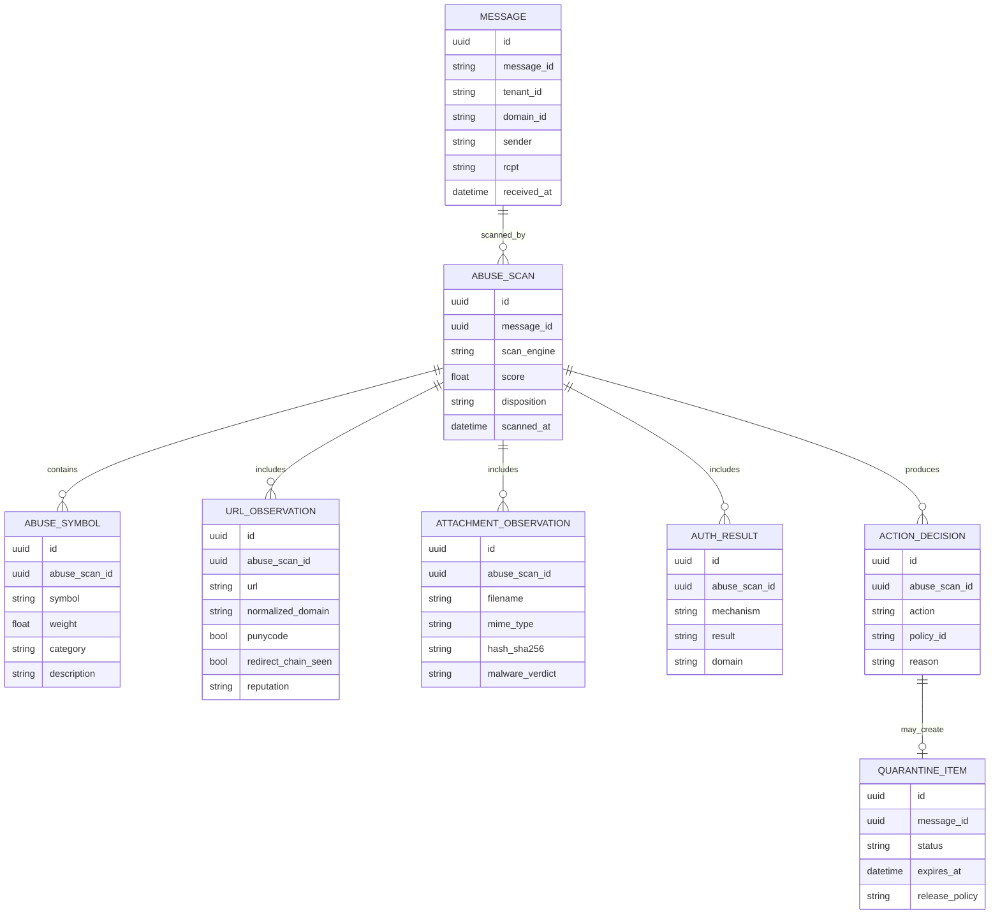

## Policy layers

Policies should stack from broad to narrow.

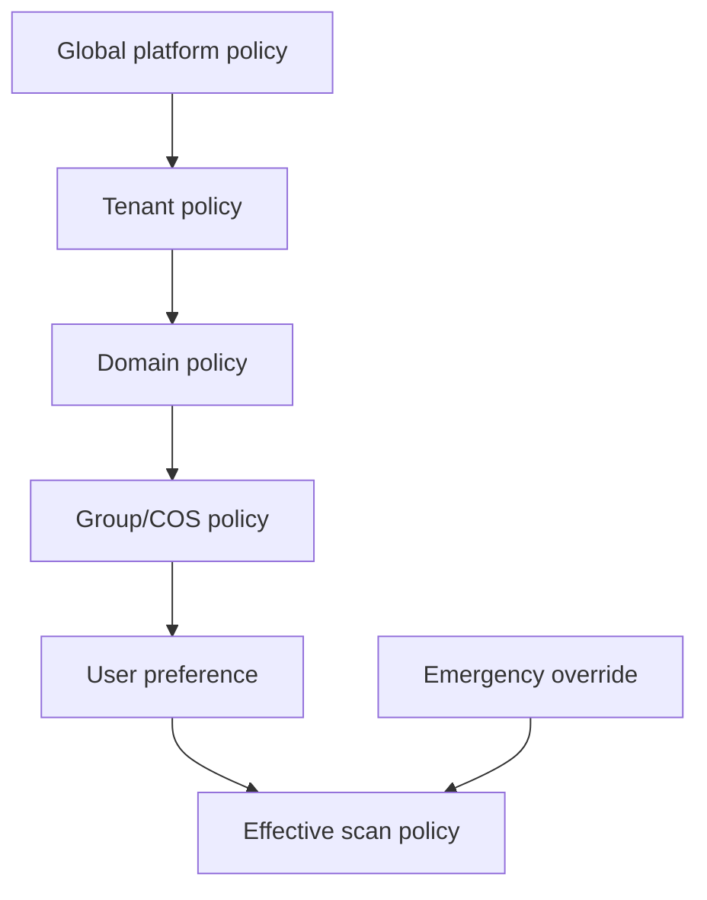

Suggested policy fields:

| Policy field | Example |
|---|---|
| Reject threshold | `score >= 15` |
| Quarantine threshold | `score >= 8` |
| Junk threshold | `score >= 5` |
| Malware action | reject, quarantine, hold-for-admin |
| DMARC fail action | reject, quarantine, score-only |
| External sender banner | enabled/disabled by domain/group |
| VIP impersonation list | CEO/CFO/founders/security aliases |
| Allowed sender domains | customer/supplier allowlist with auth requirements |
| High-risk TLD score | configurable symbol/weight |
| URL shortener policy | score, rewrite, quarantine, allow |
| Attachment policy | block executable/script/archive types |
| Outbound rate limits | per-user/per-domain/per-IP/device |

## Quarantine workflow

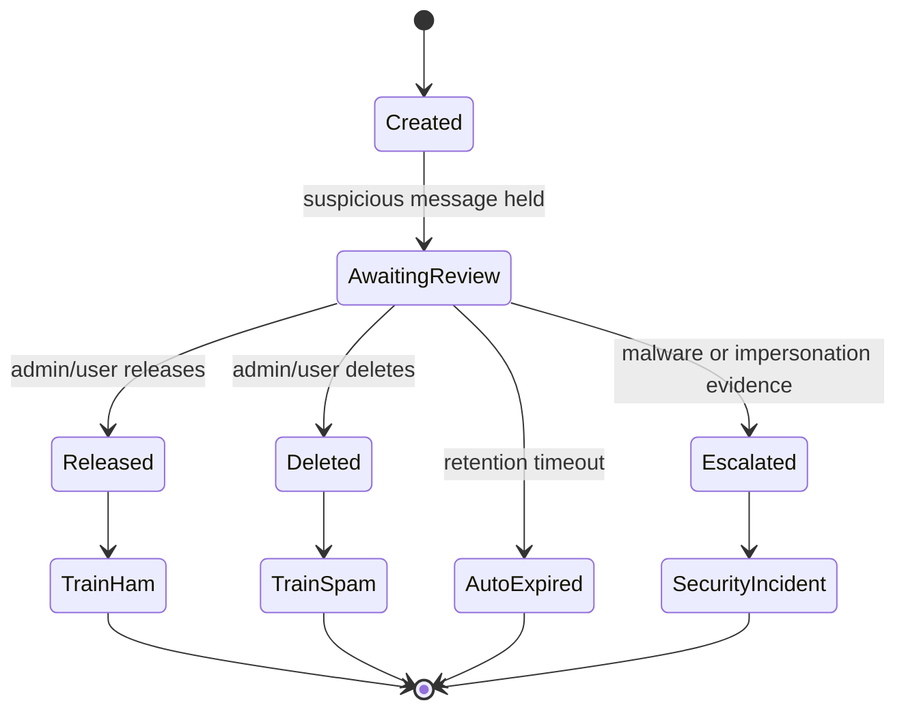

## User feedback loop

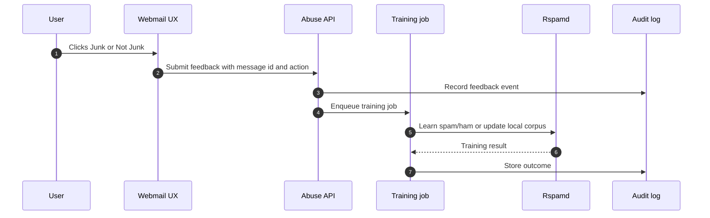

## Outbound abuse workflow

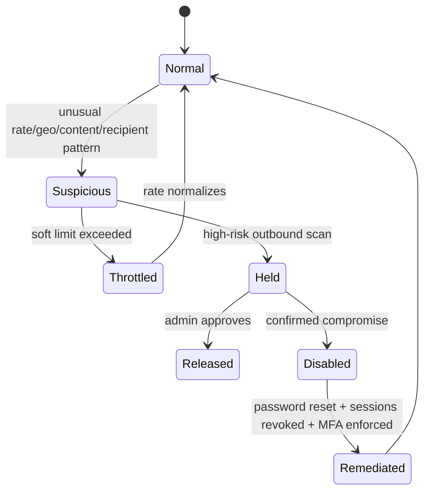

## Phishing-specific checks

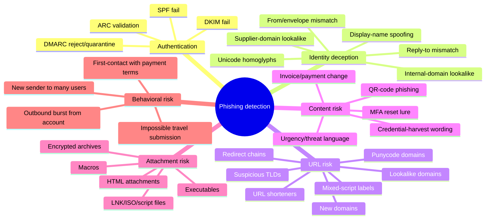

## Minimum viable abuse implementation

|| Milestone | Required behavior |
||---|---|
|| MVP-1 | Rspamd integrated with SMTP ingress; ClamAV scanning; basic SPF/DKIM/DMARC; Redis state. |
|| MVP-2 | Quarantine store and abuse UI; user/admin release/delete workflow. |
|| MVP-3 | User Junk/Not Junk feedback loop; Bayes/neural training jobs. |
|| MVP-4 | Outbound scanning, rate limits, account throttling, compromised-account workflow. |
|| MVP-5 | VIP/supplier impersonation rules, lookalike domain detection, URL evidence UI. |
|| MVP-6 | DMARC report receiver and auto-remediation; shadow-copy for security audit. |
|| Later | URL rewriting/sandboxing, detonation, commercial threat intel, legal hold integration. |

## Do not defer these

- Quarantine retention model.
- Evidence storage for scan symbols.
- User/admin training workflow.
- Outbound rate limiting.
- DMARC reporting posture + auto-remediation.
- Domain-specific policy overrides.
- Safe release path that preserves auditability.
- Quarantine digest (daily/weekly user notifications).
- Threat intelligence storage (blocklist lookups).

