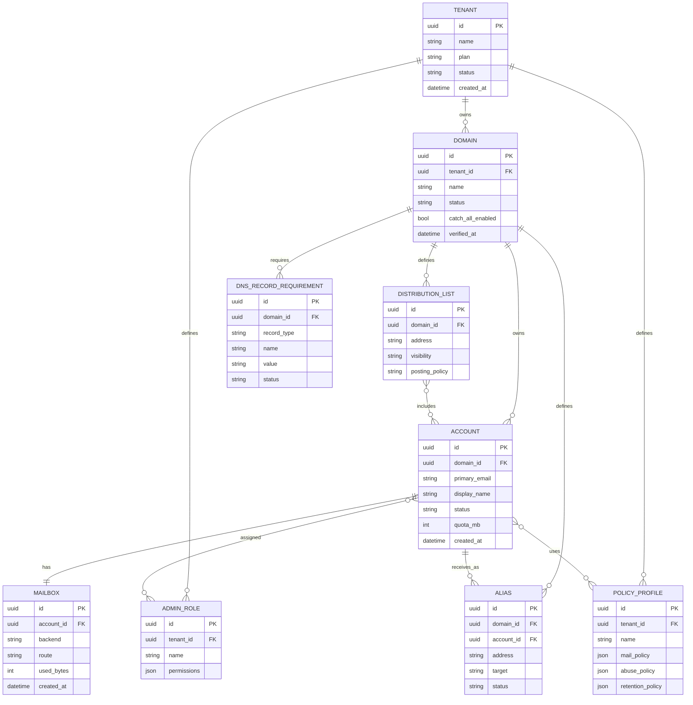
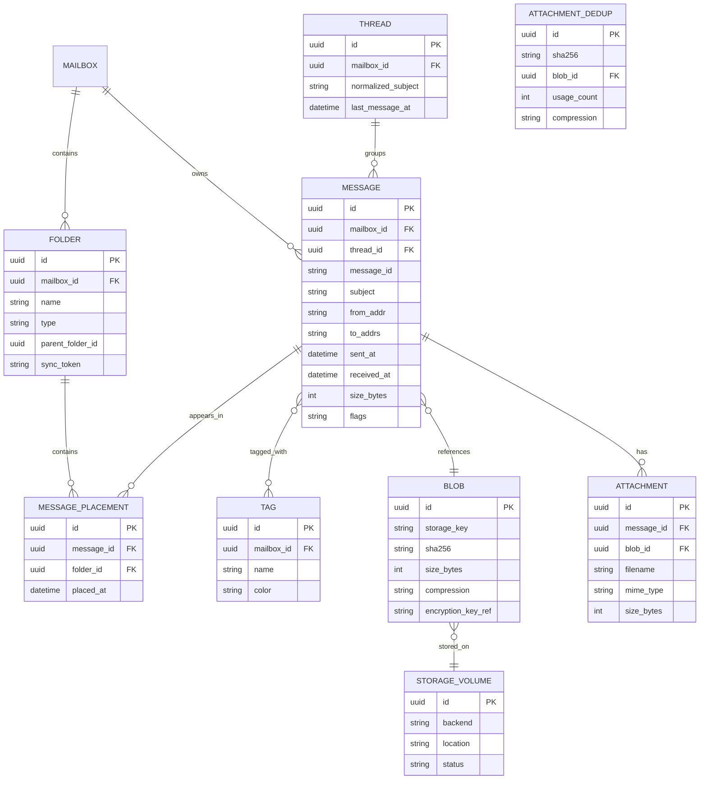
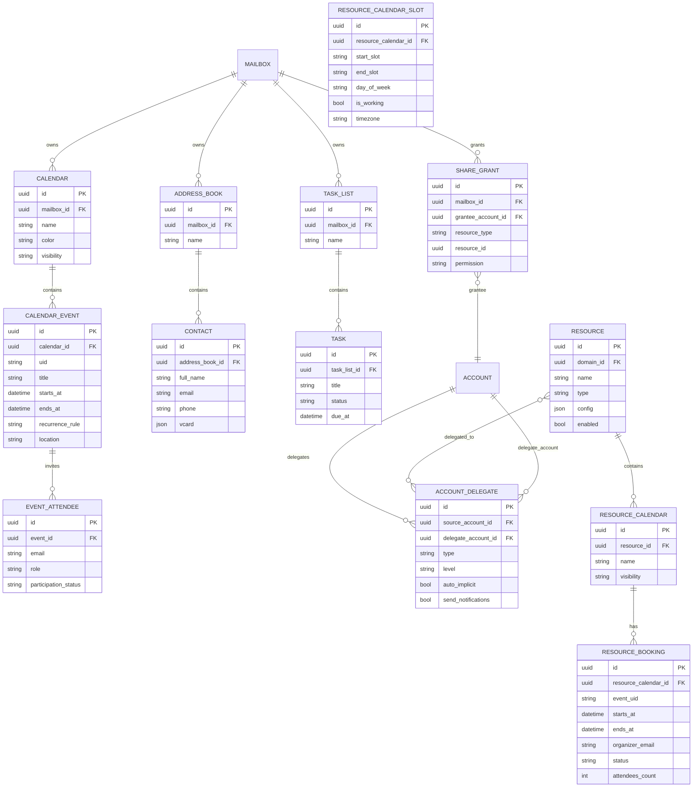
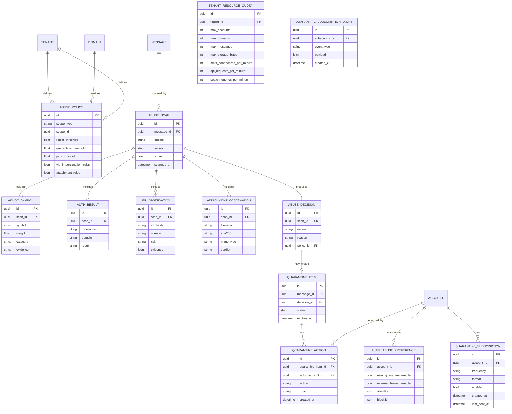
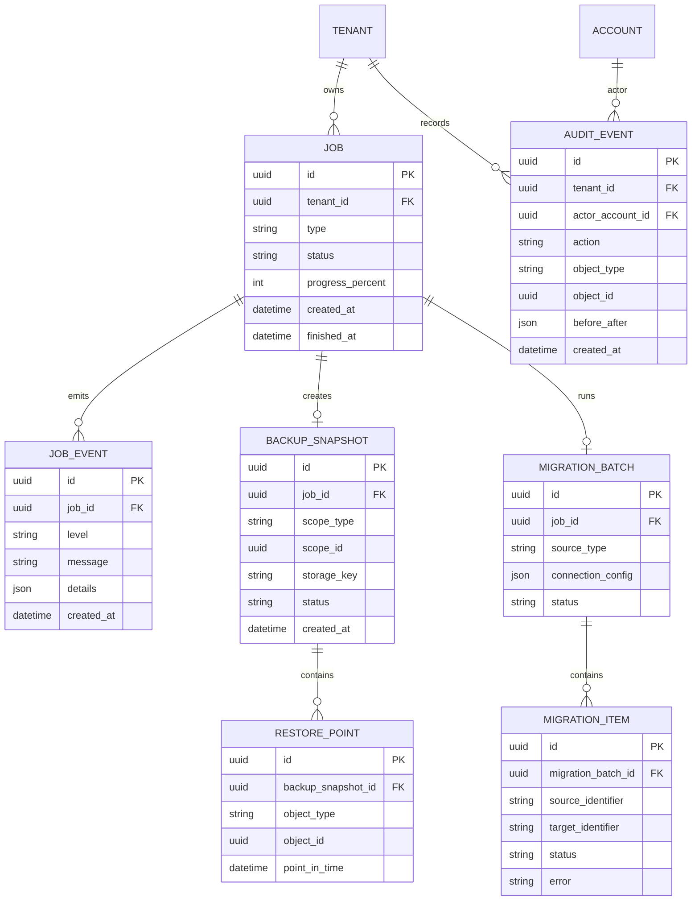
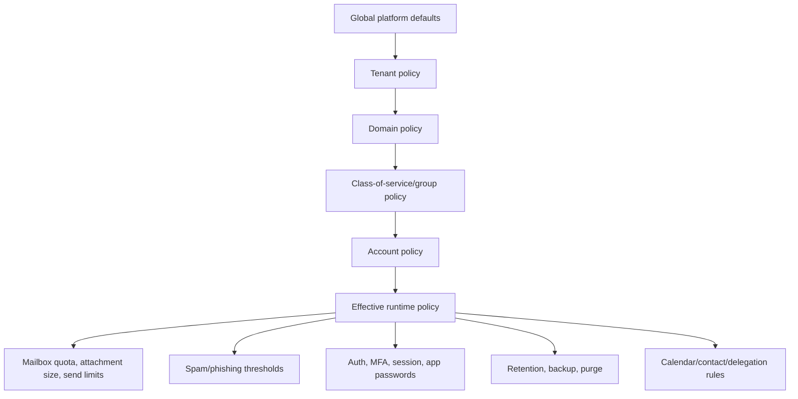
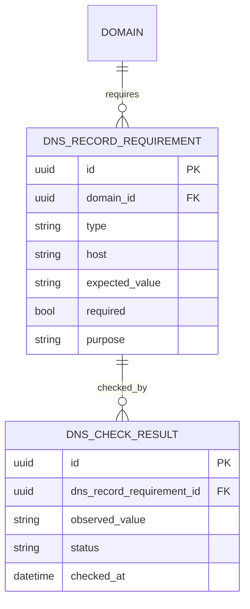
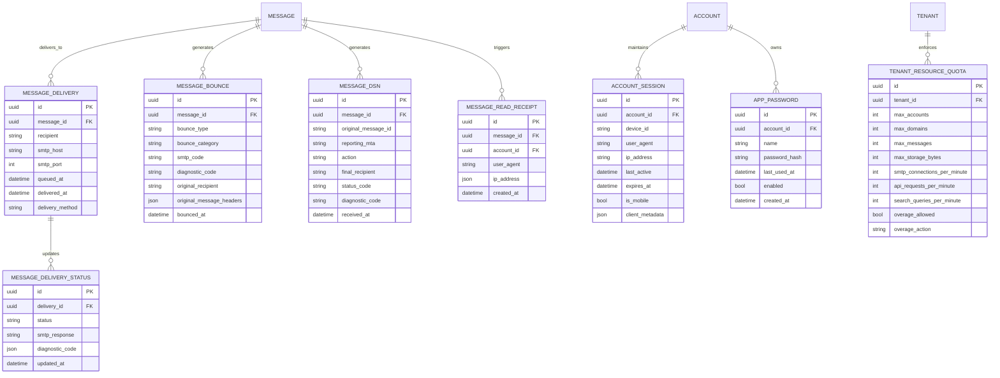
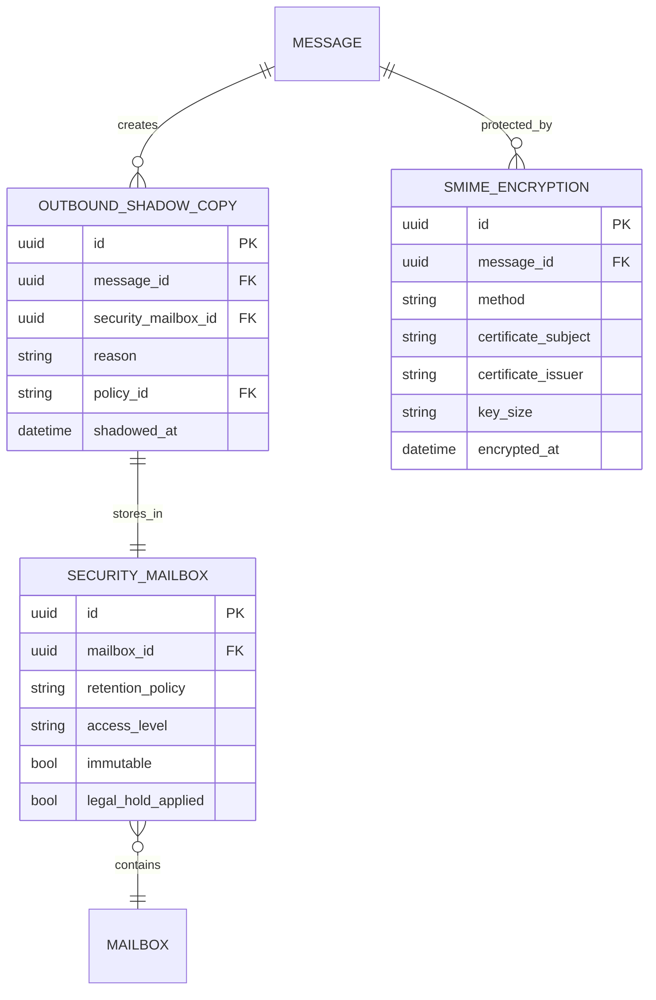
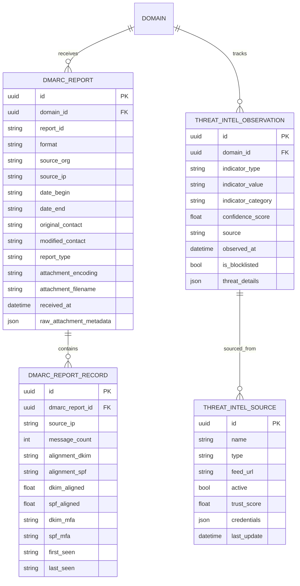

# 04 — Domain Model ERD

This is a product-oriented domain model for a greenfield mailgroupware platform.

It is not a clone of Zimbra's database schema. It is the model the new product should own.

## Core tenant/account/mailbox model

## Mailbox content model

Notes on blob storage: identical attachments across messages share a single `BLOB` record.
`ATTACHMENT` references it via `blob_id`. `ATTACHMENT_DEDUP` tracks sharing counts and
prevents orphan deletes. When usage_count reaches zero the blob is eligible for GC.

## Groupware model

Supported delegation levels:
- `full_access` — read, create, modify, delete on behalf of owner
- `write` — read and create only
- `bcc` — silently copy all incoming mail to delegate
- `auto_reply` — delegate can send auto-replies as owner

Resource types: `room`, `equipment`, `space`.

## Abuse/quarantine model

## Backup, migration, and audit model

## Policy inheritance model

## DNS model

The product should generate and track DNS requirements per domain.

Required records should include MX, SPF, DKIM, DMARC, autodiscovery where applicable, MTA-STS/TLS-RPT later, and optional BIMI later.

## Message delivery and bounce model

Messages have a full delivery lifecycle tracked in the DB. Bounce handling,
DSNs, and delivery receipts are first-class data.

Supported session fields: concurrent session limit enforced at login time.
Idle timeout (configurable per policy) triggers session expiry.
Concurrent session revocation is admin-controlled.

App passwords are one-time-use hashed tokens for IMAP/DAV clients when MFA is enabled.

---

## Outbound security and shadow-copy model

Enterprise security requires outbound message audit via shadow-copying (BCC to
security mailbox) and S/MIME encryption tracking.

Shadow-copy policy fields:
- `always` — shadow every outbound message
- `by_recipient` — shadow when recipient is external
- `by_domain` — shadow when recipient matches blocked TLD list
- `by_keyword` — shadow when body contains credential/payment keywords
- `by_outbound_volume` — shadow when user exceeds daily outbound threshold

---

## DMARC reporting and threat intelligence model

DMARC aggregate/forensic reports and threat intelligence observations are stored
for compliance and adaptive filtering.

Threat intel supports indicators: domain, IP, URL hash, email hash, file hash,
display name, attachment filename. Categories: phishing, malware, spam,
business email compromise (BEC), credential harvesting.
