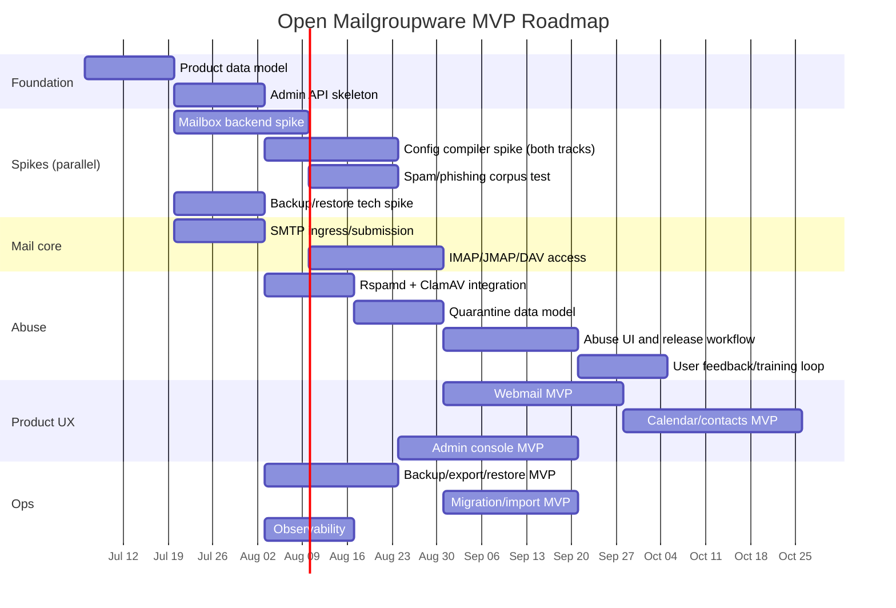
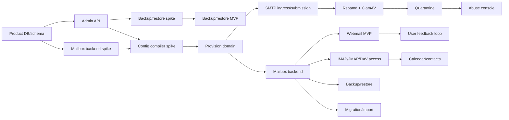
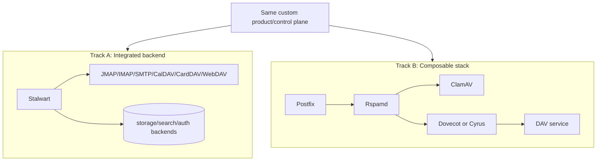
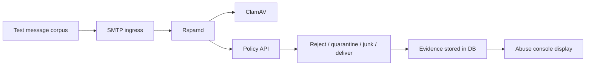
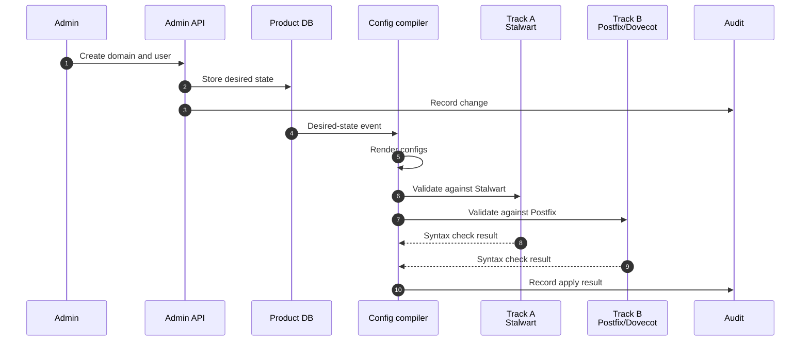
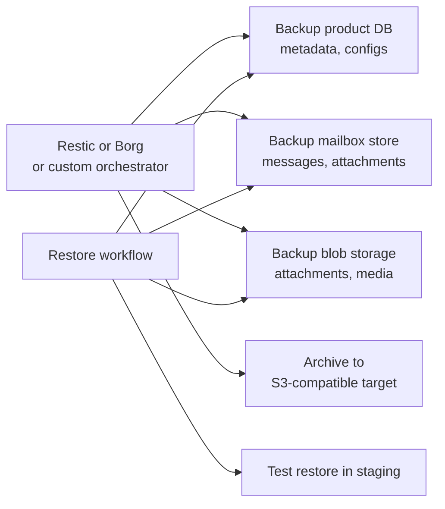
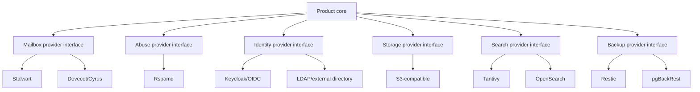
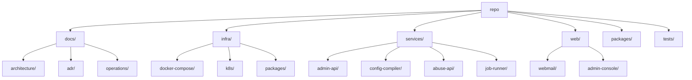
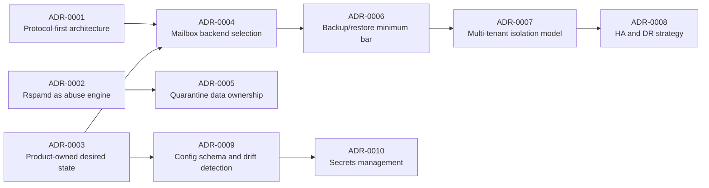

# 05 — Build Roadmap

This roadmap assumes a greenfield product built around FOSS infrastructure.

The goal is not to recreate every Zimbra Network Edition feature. The goal is a credible, modern, self-hostable mailgroupware product with strong admin UX and abuse protection.

## MVP slices



The dates are placeholders for sequencing, not promises. In a repository, this Gantt should be converted into issues/milestones.

## Milestone dependency graph



Key change from prior version: mailbox backend spike and config compiler spike
now run **in parallel** — the config compiler spike renders configs for both
Track A and Track B backends so the decision (ADR-0004) can be informed by
working prototypes, not just theory.

## Technical spikes

### Spike 1 — Backend choice

Compare these two options with the same product/control plane:



Score each track on:

| Criterion | Why it matters |
|---|---|
| Operational simplicity | Fewer moving parts means fewer customer failures. |
| Protocol coverage | Web, desktop, mobile, and migration compatibility. |
| Extensibility | Ability to inject product policy and admin controls. |
| Backup/restore story | Determines production trust. |
| Search quality | Webmail usability depends on search. |
| Calendar/contact maturity | Zimbra-like value requires groupware, not just mail. |
| Abuse integration | Rspamd/ClamAV/policy/quarantine path must be clean. |
| Multi-tenancy | Domains, quotas, routing, admin delegation. |

### Spike 2 — Abuse pipeline

Deliver one inbound message through:



Acceptance criteria:

- show score and symbols per message
- quarantine suspicious message
- release message into mailbox
- mark message as spam/ham
- trigger training job
- audit every action

### Spike 3 — Provisioning compiler

The admin API should generate service config from desired state. **Run in parallel
with Track A and Track B backends** to validate compiler output against both stacks.



Acceptance criteria:
- renders valid config for Track A (Stalwart) with zero syntax errors
- renders valid config for Track B (Postfix + Dovecot) with zero syntax errors
- validates config via service-level syntax check before apply
- supports staged rollout (one node, verify, proceed to next)
- drift detector compares desired state against generated configs

### Spike 4 — Backup and restore technology

Evaluate Restic vs Borg vs custom mailbox-level backup against these criteria:



Acceptance criteria:
- backup a test tenant in < 30 minutes for 10GB mailbox set
- restore a single mailbox from backup in < 5 minutes
- restore a single message from backup in < 30 seconds
- backup is idempotent (can be rerun without corruption)
- restore tested in staging environment before MVP

### Spike 5 — Migration technology

Evaluate IMAP migration, Exchange/Office 365 migration, and calendar/contacts migration:

```mermaid
flowchart LR
  Source[Source system<br/>IMAP/Zimbra/Exchange/O365] --> Creds[Credential collection<br/>IMAP + EWS/Graph API]
  Creds --> Extract[Extract messages<br/>calendars + contacts]
  Extract --> Transform[Transform to product<br/>domain model]
  Transform --> Validate[Validate in staging<br/>before production]
  Validate --> Load[Load into mailbox]
  Load --> Checkpoint[Checkpoint progress<br/>resume on failure]
  Checkpoint --> Report[Progress report to<br/>admin dashboard]
```



Acceptance criteria:
- migrate IMAP mailbox (messages + folders) for 100 accounts
- migrate Exchange/O365 (messages + calendar + contacts) for 100 accounts
- migration resumes from last checkpoint on failure
- admin can view per-user progress in real-time
- validate migrated data matches source (message count, folder structure)

## MVP feature boundary

### Must have

- domain provisioning
- user/account provisioning
- aliases
- distribution lists
- SMTP inbound/outbound
- IMAP
- JMAP or equivalent webmail API
- CalDAV/CardDAV or equivalent groupware API
- webmail
- calendar
- contacts
- Rspamd integration
- ClamAV integration
- SPF/DKIM/DMARC handling
- DMARC auto-remediation
- quarantine
- abuse dashboard
- user spam/ham feedback
- outbound shadow-copy (security audit)
- threat intelligence (blocklist lookups)
- outbound rate limiting
- backup/export/restore
- IMAP migration (messages + folders)
- Exchange/O365 migration (messages + calendar + contacts)
- user delegation (shared mailbox, BCC)
- resource booking (conference room)
- audit log
- tenant isolation (RLS, prefix-based)
- resource quotas (per-tenant limits)

### Should have soon after MVP

- delegated admin
- policy profiles / class of service
- resource calendars
- shared calendars/contact books
- Sieve UI
- mailbox search tuning
- DNS setup assistant
- per-domain deliverability diagnostics
- staged upgrades
- restore single message/folder/mailbox

### Defer

- ActiveSync/EAS
- EWS/MAPI/Outlook connector
- legal hold/eDiscovery
- immutable archive
- document editing
- chat/video
- URL sandbox detonation
- complex HA automation

## Product seams to keep stable



## Decision gates (closed)

| Gate | Decision | Date | Document |
|------|----------|------|----------|
| Mailbox backend | **Track A: Stalwart** (integrated stack) | 2026-07-16 | ADR-0004 |
| Deployment target | **Kubernetes** with Helm + GitOps | 2026-07-16 | ADR-0011 |
| Search engine | **Tantivy** (embedded, Rust-native) | 2026-07-16 | ADR-0004 |
| Abuse engine | **Rspamd** (multi-tenant capable) | 2026-07-16 | ADR-0002 |
| Cache | **Redis** with ACL for key prefixing | 2026-07-16 | — |
| Blob storage | **MinIO** (self-hosted) or **Cloud S3** | 2026-07-16 | — |
| OIDC provider | **Authentik** (native SaaS multi-tenancy) | 2026-07-16 | ADR-0004 |
| Backup | **pgBackRest** (PostgreSQL) + **Restic** (blob) | 2026-07-16 | ADR-0006 |

## Early repository layout



Suggested filesystem:

```text
docs/
  architecture/
    01-component-catalog.md
    02-greenfield-architecture.md
    03-abuse-pipeline.md
    04-domain-model-erd.md
    05-build-roadmap.md
    06-design-audit.md
    07-multi-tenancy-isolation.md
    08-security-model.md
  adr/
    0001-protocol-first.md
    0002-rspamd-as-abuse-engine.md
    0003-product-owned-control-plane.md
    0004-mailbox-backend-selection.md
    0005-quarantine-data-ownership.md
    0006-backup-restore-minimum-bar.md
    0007-multi-tenant-isolation-model.md
    0008-ha-dr-strategy.md
    0009-config-schema-drift-detection.md
    0010-secrets-management.md
infra/
  docker-compose/
  k8s/
services/
  admin-api/
  config-compiler/
  abuse-api/
  job-runner/
web/
  webmail/
  admin-console/
packages/
  sdk/
  config-schema/
tests/
  corpus/
  integration/
```

## First ADRs to write



### ADR summaries

**ADR-0001: Protocol-first architecture.** The product builds on standard protocols
(SMTP, IMAP, JMAP, CalDAV, CardDAV, OIDC) rather than proprietary APIs. This
enables component replacement and client interoperability.

**ADR-0002: Rspamd as abuse engine.** Rspamd is the default abuse scoring engine.
It provides spam/phishing/malware scoring, SPF/DKIM/DMARC, Bayes, neural nets,
and fuzzy hashes in a single service.

**ADR-0003: Product-owned desired state.** The admin model, policy model, and
abuse workflow are custom. The config compiler translates desired state into
service-specific configs. No hand-edited production configs.

**ADR-0004: Mailbox backend selection.** Choose between Track A (Stalwart
integrated) and Track B (Postfix/Dovecot composable). Decision informed by
parallel spike results. Criteria: operational simplicity, protocol coverage,
extensibility, backup/restore, search, calendar maturity, abuse integration,
multi-tenancy.

**ADR-0005: Quarantine data ownership.** Quarantine items and their evidence
(scan symbols, decisions, audit actions) are owned by the product DB, not by
Rspamd. This enables the abuse console, user feedback loop, and compliance.

**ADR-0006: Backup/restore minimum bar.** Restic (or Borg) for file-level backup,
custom orchestrator for mailbox-level restore. Backup tested in staging. Single
message restore in < 30s.

**ADR-0007: Multi-tenant isolation model.** Default to single PostgreSQL with RLS
on all tenant-scoped tables. Redis key prefix isolation. S3 prefix isolation with
IAM policies. Schema-per-tenant optional for data-heavy tenants.

**ADR-0008: HA and DR strategy.** PostgreSQL streaming replication + pg_auto_failover
for primary DB. Redis Sentinel for state. S3 cross-region replication for blobs.
RPO/RTO targets defined per component. DR region with warm standby.

**ADR-0009: Config schema and drift detection.** Config compiler validates against
JSON Schema for each service before applying. Drift detector compares generated
configs against live service configs. Alert on divergence.

**ADR-0010: Secrets management.** HashiCorp Vault or SSM Parameter Store for
secrets. TLS certificates auto-provisioned via ACME (Let's Encrypt). DKIM keys
rotated quarterly. mTLS for internal service communication.

## Success criteria for first usable release

A first release is meaningful when an admin can:

1. add a domain;
2. see required DNS records;
3. create users and aliases;
4. create user delegation (shared mailbox, BCC);
5. receive and send mail;
6. read mail in webmail and IMAP;
7. use calendar and contacts;
8. book a conference room resource;
9. see spam/phishing evidence;
10. release or delete quarantined mail;
11. receive a daily quarantine digest;
12. restore a mailbox or message;
13. migrate mail from an old IMAP/Zimbra account;
14. migrate calendar and contacts from IMAP/Zimbra.

If those fourteen workflows are solid, the platform is already more useful than most
open mail-server bundles.

