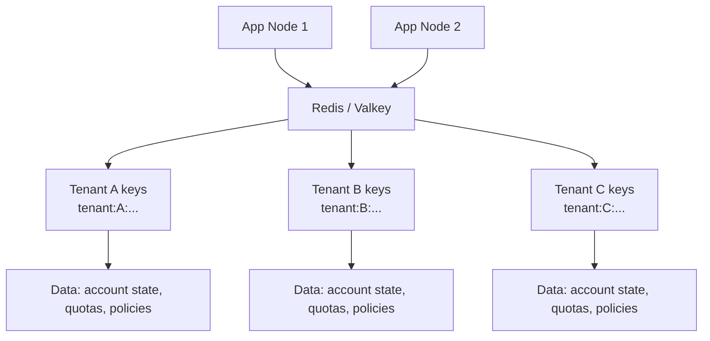
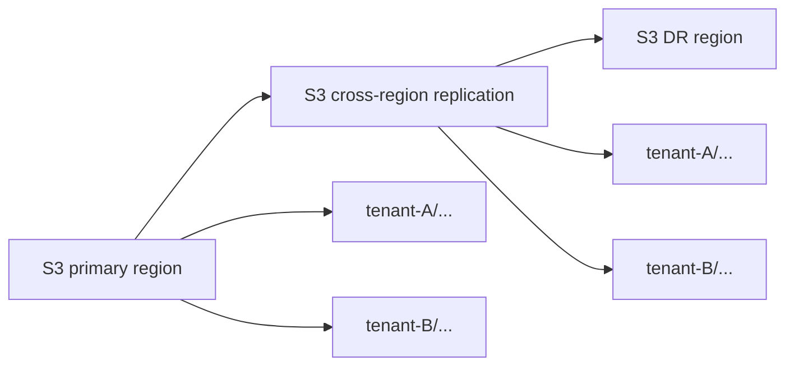
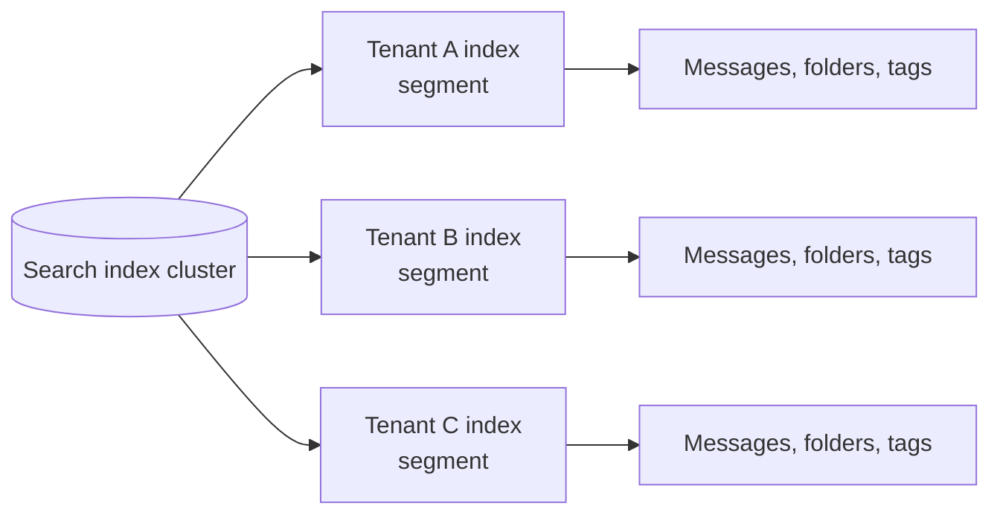
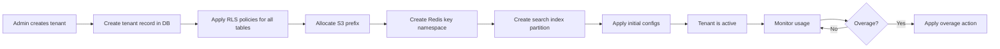
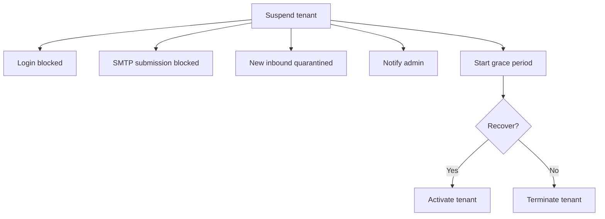
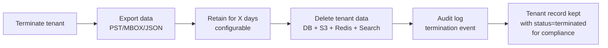
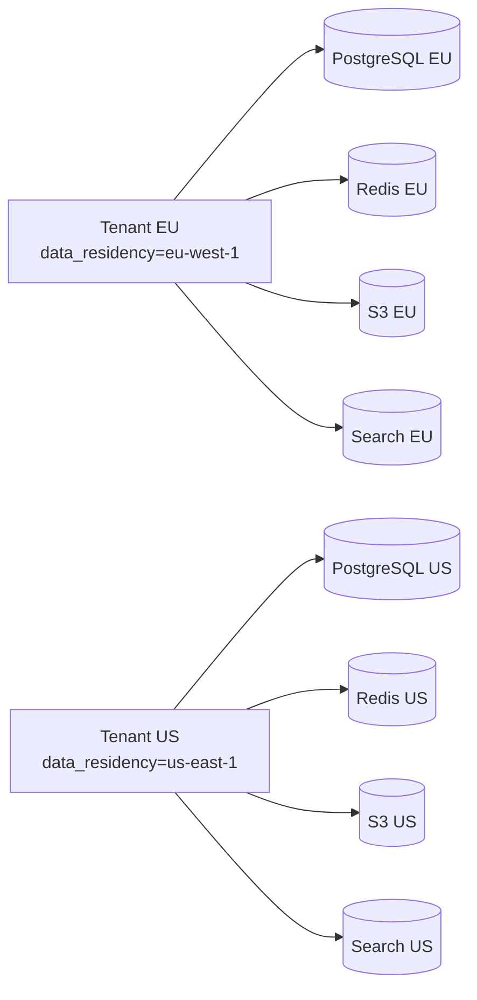

# 07 — Multi-Tenant Isolation Model

This document defines how tenants are isolated in shared infrastructure. It addresses
the P0 gap identified in the design audit.

## Isolation strategy

The product supports **multi-tenant deployments** where multiple tenants share
PostgreSQL, Redis, blob storage, and search infrastructure. Isolation is enforced
at multiple layers to prevent cross-tenant data leakage.

### Default isolation model: RLS-based

For most deployments (up to ~10K accounts per tenant), the default is a **single
PostgreSQL database** with row-level security (RLS) policies on all tenant-scoped
tables.

```mermaid
flowchart TB
  classDef custom fill:#e8f0fe,stroke:#1565c0,color:#111
  classDef foss fill:#e8f7e8,stroke:#2e7d32,color:#111
  classDef data fill:#f3e5f5,stroke:#6a1b9a,color:#111
  classDef risk fill:#fdeaea,stroke:#b71c1c,color:#111

  UserA[User in Tenant A]:::custom
  UserB[User in Tenant B]:::custom
  Admin[Admin in Tenant A]:::custom

  UserA --> Proxy[API Gateway / Proxy]:::foss
  UserB --> Proxy
  Admin --> Proxy

  Proxy --> Auth[OIDC Auth + Tenant Resolver]:::foss
  Auth --> AuthContextA[Tenant A context<br/>tenant_id = UUID-A]
  Auth --> AuthContextB[Tenant B context<br/>tenant_id = UUID-B]

  AuthContextA --> PG[(PostgreSQL)]:::data
  AuthContextB --> PG

  PG --> PG_RLS[RLS Policies]:::foss
  PG_RLS --> PG_RLS_SQL[WHERE tenant_id = current_setting('app.current_tenant_id')]:::foss

  AuthContextA --> Redis[(Redis)]:::data
  AuthContextB --> Redis

  Redis --> Redis_A[Tenant-scoped keys<br/>tenant:A:...]:::foss
  Redis --> Redis_B[Tenant-scoped keys<br/>tenant:B:... ]:::foss

  Proxy --> Blob[S3-compatible<br/>object storage]:::data
  Blob --> Blob_A[Prefix: tenant-A/]:::foss
  Blob --> Blob_B[Prefix: tenant-B/]:::foss

  Proxy --> Search[(Search index)]:::data
  Search --> Search_A[Tenant A index<br/>partition]:::foss
  Search --> Search_B[Tenant B index<br/>partition]:::foss
```

### Isolation layers

| Layer | Mechanism | Enforced by | Cross-tenant leak risk |
|-------|-----------|-------------|----------------------|
| **PostgreSQL** | RLS policies on every tenant-scoped table | Database + app layer | Low (RLS enforced at DB level) |
| **PostgreSQL** | `tenant_id` FK on every row | App layer + database constraints | Low (FK enforced by DB) |
| **Redis** | Key prefix `tenant:{id}:` | Config compiler + app middleware | Medium (app-level only) |
| **S3/Blob** | Prefix `tenant-{id}/` + IAM policies | Storage backend + IAM | Low (enforced by S3) |
| **Search** | Tenant-scoped index partition | App layer | Medium (app-level only) |
| **SMTP** | Per-tenant queue partition | MTA config | Low (enforced by MTA) |
| **Resource quotas** | `TENANT_RESOURCE_QUOTA` enforced at API | Admin API | Medium (app-level only) |

### RLS policy generation

The config compiler generates PostgreSQL RLS policies for every tenant-scoped table.

```sql
-- Example RLS policy for ACCOUNT table
CREATE POLICY tenant_isolation_account ON account
  FOR ALL
  USING (tenant_id = current_setting('app.current_tenant_id')::uuid);

-- Enable RLS
ALTER TABLE account ENABLE ROW LEVEL SECURITY;

-- Superuser bypass (for platform admin operations)
ALTER TABLE account FORCE ROW LEVEL SECURITY;
```

### Config compiler integration

When a tenant is created, the config compiler:
1. Creates the tenant record in the product DB
2. Generates and applies RLS policies for all tenant-scoped tables
3. Creates Redis key prefix namespace
4. Allocates S3 prefix and IAM policy
5. Creates search index partition

```mermaid
flowchart LR
  A[Admin API creates tenant] --> B[Product DB: INSERT tenant]
  B --> C[Config compiler triggered]
  C --> D[Generate RLS policies]
  D --> E[Apply RLS to PG]
  E --> F[Create Redis key namespace]
  F --> G[Allocate S3 prefix + IAM]
  G --> H[Create search index partition]
  H --> I[Apply initial service configs]
  I --> J[Tenant is active]
```



## Alternative: schema-per-tenant

For **data-heavy tenants** (10K+ accounts, high message volume), schema-per-tenant
provides stronger isolation and better performance.

```mermaid
flowchart LR
  TenantA[Tenant A schema] --> PG1[(PostgreSQL)]
  TenantB[Tenant B schema] --> PG1
  TenantC[Tenant C schema] --> PG1

  PG1 --> PG_Flat[Flat tables (shared schema)]:::risk
  PG1 --> PG_Schema[Schema-per-tenant]:::foss
  PG1 --> PG_RLS_DB[RLS on flat tables]:::foss
```

### When to use schema-per-tenant

| Criteria | Flat + RLS | Schema-per-tenant |
|----------|-----------|-------------------|
| Accounts per tenant | < 10K | > 10K |
| Messages per month | < 1M | > 1M |
| Storage per tenant | < 1TB | > 1TB |
| Compliance requirement | Standard | Strict data segregation |
| Backup granularity | Per-database | Per-schema |
| Restore speed | Slower (full DB) | Faster (single schema) |
| Config compiler complexity | Lower | Higher |

### Schema-per-tenant implementation

Each tenant gets its own schema within the same PostgreSQL database:

```
Schema name: tenant_{uuid}
Tables: account, domain, mailbox, message, folder, ...
RLS: Not needed (schema isolation is physical)
Backup: pg_dump --schema=tenant_{uuid}
Restore: pg_restore --schema=tenant_{uuid}
```

The config compiler manages schema creation, table migration, and index optimization
per tenant schema. Schema names are stored in a registry table:

```sql
CREATE TABLE tenant_schema_registry (
  tenant_id UUID PRIMARY KEY,
  schema_name TEXT NOT NULL,
  backend TEXT NOT NULL,  -- 'flat_rls' or 'schema_per_tenant'
  created_at TIMESTAMPTZ NOT NULL DEFAULT now()
);
```

## Redis isolation

### Key prefix convention

All Redis keys use the tenant prefix:

```
tenant:{tenant_id}:account:{account_id}
tenant:{tenant_id}:mailbox:{mailbox_id}:sync_token
tenant:{tenant_id}:quarantine:pending
tenant:{tenant_id}:quota:used_bytes
tenant:{tenant_id}:policy:effective
tenant:{tenant_id}:search:index
tenant:{tenant_id}:abuse:score:{message_id}
```

### Key namespace isolation

Redis keys from different tenants are never mixed. The config compiler validates
key prefixes before any write operation.



### Redis data that is tenant-scoped

| Data | Key pattern | TTL |
|------|------------|-----|
| Account sessions | `tenant:{id}:sessions:{account_id}` | Configurable per policy |
| Mailbox sync tokens | `tenant:{id}:mailbox:{id}:sync_token` | No TTL |
| Quota counters | `tenant:{id}:quota:used_bytes` | No TTL |
| Rspamd state | `tenant:{id}:rspamd:{message_id}` | 30 days |
| Rate limit counters | `tenant:{id}:ratelimit:{ip}:minute` | 60 seconds |
| Abuse scores | `tenant:{id}:abuse:score:{message_id}` | 30 days |
| Cache: tenant config | `tenant:{id}:config:effective` | 5 minutes |

## S3/Blob storage isolation

### Prefix convention

Each tenant gets a dedicated prefix in the S3 bucket:

```
Bucket: opengroupware-blobs
Prefix per tenant:
  tenant-{tenant_id}/
    {mailbox_id}/
      {message_id}/
        message.eml
        attachment_1.pdf
        thumbnail_1.jpg
```

### IAM policies (future)

Each tenant gets an IAM policy that restricts access to their prefix:

```json
{
  "Effect": "Allow",
  "Action": ["s3:GetObject", "s3:PutObject"],
  "Resource": "arn:aws:s3:::opengroupware-blobs/tenant-{uuid}/*"
}
```

### Cross-region replication

Blob storage uses S3 cross-region replication for DR:



### Tenant storage quotas

The `TENANT_RESOURCE_QUOTA` table enforces per-tenant storage limits:

```sql
CREATE TABLE tenant_resource_quota (
  tenant_id UUID PRIMARY KEY,
  max_storage_bytes BIGINT NOT NULL DEFAULT 10737418240,  -- 10 GB default
  current_storage_bytes BIGINT NOT NULL DEFAULT 0,
  overage_allowed BOOLEAN NOT NULL DEFAULT false,
  overage_action TEXT NOT NULL DEFAULT 'reject',  -- 'reject', 'warn', 'allow'
  overage_limit_bytes BIGINT,
  created_at TIMESTAMPTZ NOT NULL DEFAULT now()
);
```

When `current_storage_bytes` exceeds `max_storage_bytes`:
- `overage_allowed = false`: reject new writes (blob storage returns 413)
- `overage_allowed = true`: allow up to `overage_limit_bytes`
- `overage_action = 'warn'`: allow but log a warning for the admin

## Search isolation

### Tenant-scoped queries

All search queries include a tenant filter:

```
GET /search
Query: {
  "tenant_id": "uuid-of-tenant",
  "query": "invoice",
  "mailbox_id": "uuid-of-mailbox",
  "from": "sender@example.com"
}
```

The search backend enforces tenant_id as a required filter. Queries without
tenant_id are rejected.

### Index partitioning

Search indexes are partitioned by tenant. Each tenant gets their own index
(or index segment) within the shared search cluster:



For large deployments, each tenant gets a dedicated index. For smaller deployments,
tenant segments are used within a shared index.

## SMTP isolation

### Per-tenant connection limits

The config compiler generates SMTP connection limits per tenant:

```
# Postfix config example (generated by config compiler)
smtpd_client_connection_rate_limit = 100  # per-tenant rate limit
smtpd_client_message_rate_limit = 500     # per-tenant message rate limit
```

### Queue partitioning

SMTP queues are partitioned by tenant. Messages from different tenants never
share the same queue:

```
/var/spool/postfix/incoming/
  tenant-{uuid-A}/
    active/
    deferred/
    bounce/
  tenant-{uuid-B}/
    active/
    deferred/
    bounce/
```

## Tenant lifecycle

### Create tenant



### Suspend tenant

When a tenant is suspended (e.g., non-payment, compliance violation):
1. Disable login (OIDC reject)
2. Block SMTP submission (Outbound only, inbound accepted)
3. Flag mail as quarantined (new inbound)
4. Notify tenant admin
5. Grace period (configurable, default 7 days)



### Terminate tenant

When a tenant is terminated (end of contract, data deletion request):
1. Export data (configurable format: PST, MBOX, JSON)
2. Data retention period (configurable, default 30 days)
3. Delete tenant records from DB
4. Delete S3 prefix
5. Delete Redis keys
6. Delete search index partition
7. Mark tenant as `terminated` in audit log



## Edge cases

### Tenant with no data

New tenants with zero accounts still allocate S3 prefix and search index to
prevent namespace reuse and ensure consistent infrastructure.

### Tenant data export

Data export is a first-class operation with the following steps:
1. Export product DB (account, domain, mailbox metadata)
2. Export mailbox store (messages, attachments, folders)
3. Export search index (optional)
4. Export audit log (for compliance)
5. Package as PST (Microsoft format) or MBOX (open format)
6. Notify tenant admin when export is ready

### Tenant-to-tenant merge

In rare cases (acquisition, restructuring), tenant data may need to be merged.
This is a manual operation with the following steps:
1. Export data from source tenant
2. Import data into target tenant (with tenant_id transformation)
3. Validate data integrity
4. Disable source tenant
5. Update DNS records for merged domains
6. Archive source tenant records

### Multi-region tenant

For tenants that require data residency controls, the product supports per-tenant
region assignment:



For multi-region tenants, the config compiler provisions infrastructure in the
assigned region and routes all tenant traffic to that region.

## Compliance considerations

### Data privacy (GDPR, CCPA)

The tenant model supports GDPR/CCPA requirements:
- **Right to erasure**: Tenant termination deletes all user data
- **Data portability**: Tenant export provides full data in PST/MBOX/JSON
- **Data location**: Tenant region assignment controls data residency
- **Audit trail**: All tenant operations are logged in `AUDIT_EVENT`

### Data retention

The `POLICY_PROFILE` stores retention policies per tenant. The config compiler
enforces retention policies at the service level:

| Retention setting | Effect |
|-------------------|--------|
| `archive_age_days` | Move messages older than X days to archive storage |
| `delete_age_days` | Delete messages older than X days |
| `quarantine_expiration_days` | Auto-delete quarantined messages after X days |
| `log_retention_days` | Retain audit logs for X days |
| `backup_retention_days` | Keep backups for X days |

## Summary

Multi-tenant isolation is enforced at **seven layers**:
1. PostgreSQL RLS (default) or schema-per-tenant
2. Redis key prefix isolation
3. S3 prefix + IAM policies
4. Search index partitioning
5. SMTP queue partitioning
6. Resource quotas (enforced at API layer)
7. Per-tenant data residency (future)

The config compiler is the central authority for isolation — it generates,
applies, and validates isolation configurations for all layers.