# 08 — Security Model

This document defines the security model for the platform. It addresses P1 security
gaps identified in the design audit: MFA policy, app passwords, API auth, TLS
certificates, session management, and OAuth2/PKCE.

## Authentication overview

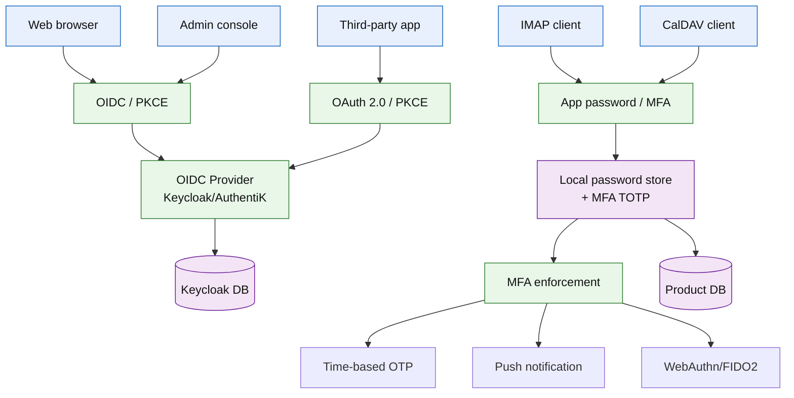

## Authentication methods

| Method | Used by | Strength | MFA supported | Notes |
|--------|---------|----------|---------------|-------|
| **OIDC / PKCE** | Webmail, Admin console | Strong | Yes (at IdP level) | Primary auth for web UI |
| **App password** | IMAP, CalDAV, CardDAV | Medium | Yes (per-client) | Generated tokens when MFA is enabled |
| **OAuth 2.0 / PKCE** | Third-party integrations | Strong | Yes (at IdP level) | For web app API access |
| **API key** | Admin API, service-to-service | Strong | N/A | Scoped tokens with expiry |
| **mTLS** | Internal service communication | Strong | Yes (cert-based) | Config compiler provisions certs |

## Multi-factor authentication (MFA)

### MFA policy model

MFA is enforced per-account via the `ACCOUNT` table and `POLICY_PROFILE`:

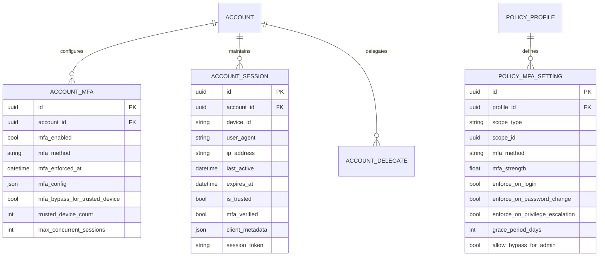

### MFA enforcement flow

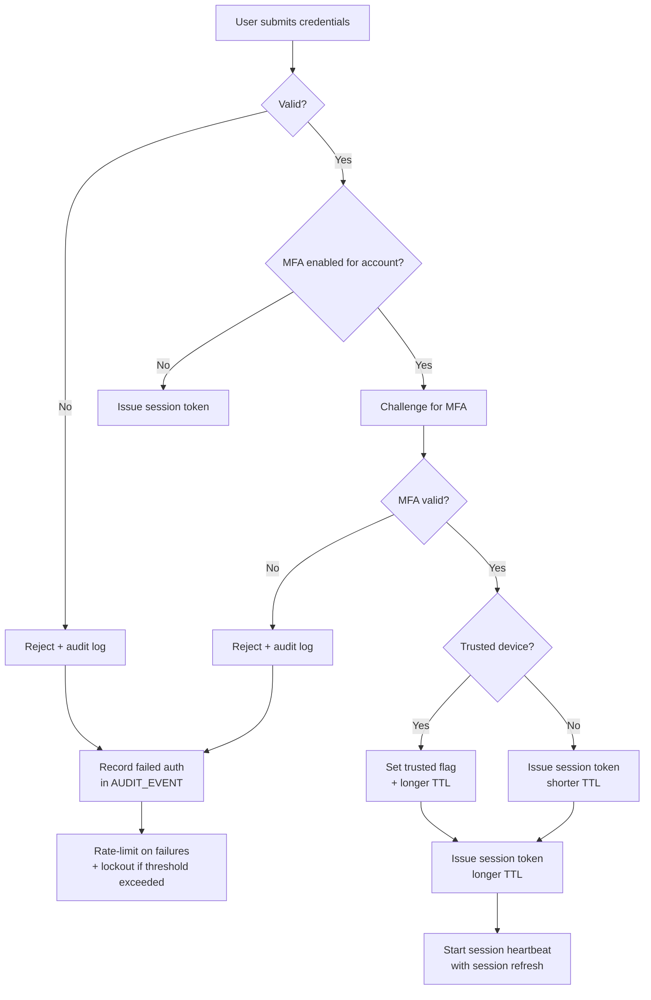

### MFA methods

| Method | Strength | Mobile support | Hardware required | Use case |
|--------|----------|---------------|-------------------|----------|
| **TOTP** (RFC 6238) | Medium | Yes | Phone with app | Default MFA method |
| **Push notification** | Medium-High | Yes | Phone with app | Enterprise push MFA |
| **WebAuthn/FIDO2** | High | Limited | Security key / biometric | High-security tenants |
| **SMS OTP** | Low | Yes | Phone number | Fallback only (not default) |
| **Email OTP** | Low | Yes | Email access | Fallback only (not default) |

### MFA policy fields

```sql
CREATE TABLE policy_mfa_setting (
  id UUID PRIMARY KEY,
  profile_id UUID NOT NULL,
  scope_type TEXT NOT NULL,  -- 'tenant', 'domain', 'group', 'user'
  scope_id UUID NOT NULL,
  mfa_method TEXT NOT NULL DEFAULT 'totp',  -- 'totp', 'push', 'webauthn', 'sms', 'email'
  mfa_strength FLOAT NOT NULL DEFAULT 0.5,   -- 0.0 to 1.0
  enforce_on_login BOOLEAN NOT NULL DEFAULT true,
  enforce_on_password_change BOOLEAN NOT NULL DEFAULT true,
  enforce_on_privilege_escalation BOOLEAN NOT NULL DEFAULT true,
  grace_period_days INT NOT NULL DEFAULT 0,  -- days before enforcement
  allow_bypass_for_admin BOOLEAN NOT NULL DEFAULT false
);
```

### MFA bypass conditions

MFA can be bypassed under these conditions:
1. **Trusted device**: User marks device as trusted (session token longer TTL)
2. **Admin bypass**: Policy allows admin to bypass MFA (rare, requires justification)
3. **Grace period**: New policy enforcement has configurable grace period

Trusted device logic:
- User marks device as trusted → session TTL extended (e.g., 30 days)
- New device → MFA required
- Revoked trusted devices → all sessions invalidated
- Max concurrent trusted devices per user: configurable (default 5)

## App passwords

### Model

App passwords are hashed tokens for IMAP/DAV clients when MFA is enabled.
They replace the user's primary password for specific clients.

```mermaid
erDiagram
  ACCOUNT ||--o{ APP_PASSWORD : owns
  ACCOUNT ||--o{ ACCOUNT_SESSION : maintains

  APP_PASSWORD {
    uuid id PK
    uuid account_id FK
    string name
    string password_hash
    datetime last_used_at
    bool enabled
    datetime created_at
    datetime expires_at
    int usage_count
    string client_type  -- 'imap', 'dav', 'custom'
    json client_metadata
  }
```

### App password lifecycle

```mermaid
flowchart TB
  A[Admin enables MFA for account] --> B[User generates app password]
  B --> C[Token hashed (bcrypt/scrypt)]
  C --> D[Hash stored in APP_PASSWORD]
  D --> E[User gives plaintext token to client]
  E --> F[Client uses token for IMAP/DAV]
  F --> G[Auth service verifies hash]
  G -->|Valid| H[Allow access<br/>+ record usage]
  G -->|Invalid| I[Reject]
  H --> J{Token expired?}
  J -->|No| F
  J -->|Yes| K[Revoke token]
  K --> L[Notify user<br/>+ require new token]

  L --> B
```

### App password policy

| Setting | Default | Description |
|---------|---------|-------------|
| Auto-expiry | 90 days | Tokens expire automatically |
| Max tokens per user | 5 | Hard limit on concurrent app passwords |
| Usage logging | Enabled | Every use logged in `ACCOUNT_SESSION` |
| Last-used tracking | Enabled | Shows when token was last used |
| One-time use | Optional | Token invalidated after first use |
| Client type restriction | None | Can restrict to IMAP, DAV, or all |

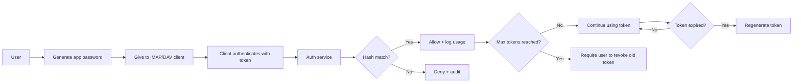

## Session management

### Session model

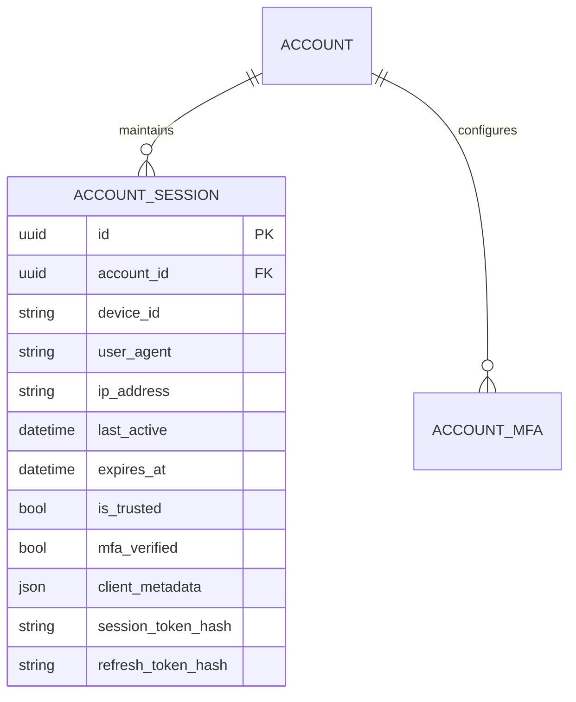

### Session lifecycle

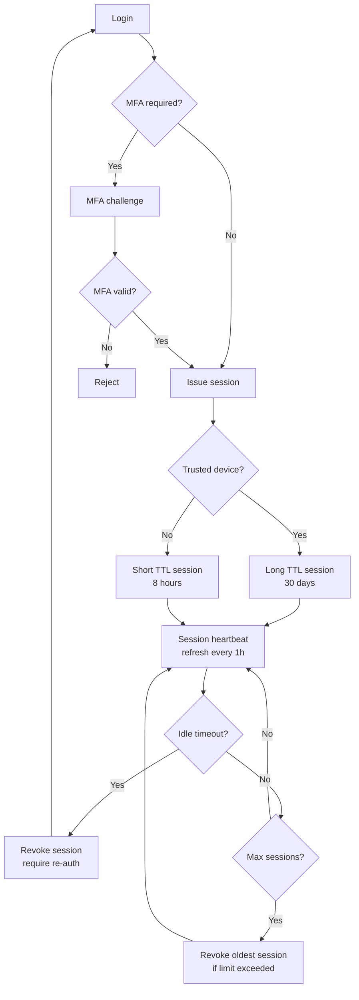

### Session policies

| Policy | Default | Configurable per scope |
|--------|---------|----------------------|
| Session TTL (untrusted) | 8 hours | Yes (min: 15 min, max: 30 days) |
| Session TTL (trusted) | 30 days | Yes |
| Max concurrent sessions | 5 | Yes |
| Idle timeout | 30 minutes | Yes |
| Trusted device duration | 30 days | Yes |
| IP binding | Optional | Yes (force session to single IP) |
| User-agent binding | Optional | Yes (reject if user-agent changes) |

### Session revocation

Admin can revoke sessions at multiple levels:

| Level | Effect | Use case |
|-------|--------|----------|
| **Single session** | Revoke one device | Lost/stolen device |
| **All sessions (account)** | Revoke all user sessions | Password change, MFA enabled |
| **All sessions (domain)** | Revoke all domain users | Domain compromise |
| **All sessions (tenant)** | Revoke all tenant users | Tenant compromise |
| **All sessions (platform)** | Revoke all users | Platform-wide incident |

## API authentication

### Admin API auth model

The Admin API supports multiple auth methods:

| Method | Use case | Strength |
|--------|----------|----------|
| **OIDC bearer token** | Web UI → Admin API | Strong (PKCE) |
| **Service API key** | Automated tools, scripts | Strong (scoped) |
| **mTLS client cert** | Internal services | Strong (certificate-based) |
| **OAuth 2.0 access token** | Third-party integrations | Strong (scoped) |

### API key model

```mermaid
erDiagram
  ACCOUNT ||--o{ API_KEY : owns
  API_KEY ||--o{ API_KEY_SCOPE : defines
  API_KEY ||--o{ API_KEY_USAGE : tracks

  API_KEY {
    uuid id PK
    uuid account_id FK
    string name
    string key_hash
    string prefix  -- first 8 chars for identification
    uuid tenant_id FK
    datetime created_at
    datetime expires_at
    datetime last_used_at
    bool enabled
    json metadata
  }

  API_KEY_SCOPE {
    uuid id PK
    uuid api_key_id FK
    string resource
    string action
    json conditions
  }

  API_KEY_USAGE {
    uuid id PK
    uuid api_key_id FK
    string endpoint
    string method
    string source_ip
    datetime accessed_at
    int response_time_ms
    string status_code
  }
```

### API key scoping

API keys are scoped to:
- **Tenant**: Only access data within the owning tenant
- **Resource**: Specific resources only (e.g., `domain:*`, `account:read`, `quota:*`)
- **Action**: Read-only, write, admin, or full
- **IP whitelist**: Only usable from specific IP ranges
- **Time window**: Only valid during specific time ranges

### OAuth 2.0 / PKCE for third-party apps

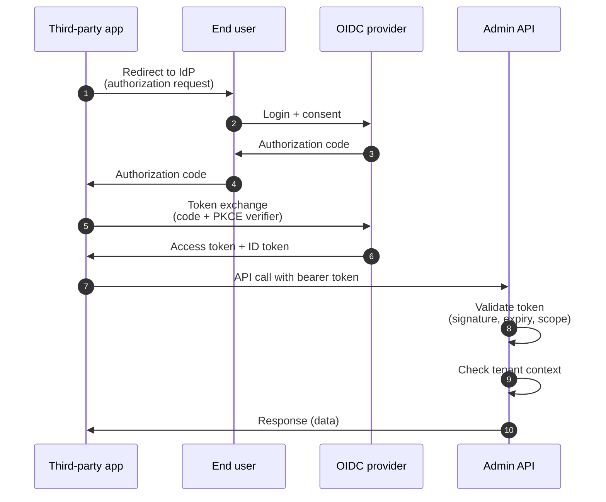

PKCE (Proof Key for Code Exchange) is required for all OAuth 2.0 flows:
- `code_challenge` and `code_challenge_method` sent in authorization request
- `code_verifier` sent in token exchange
- Prevents authorization code interception attacks

## TLS and certificate management

### TLS lifecycle

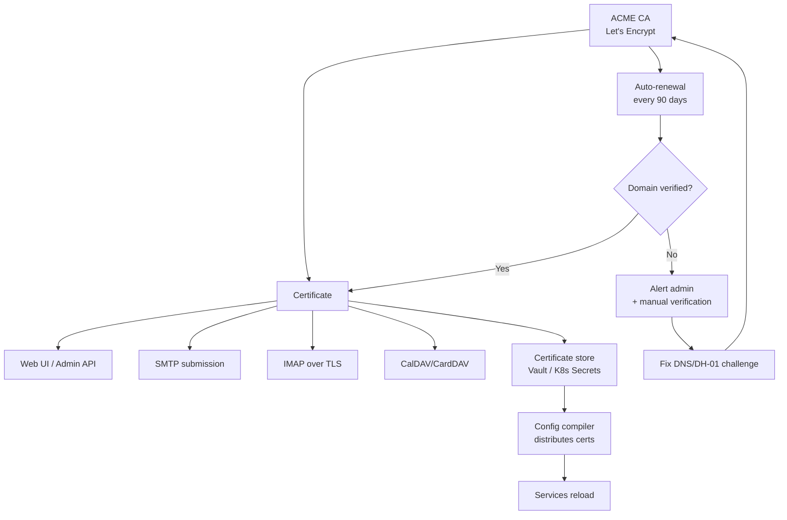

### Certificate management

| Component | TLS | Certificate source | Renewal |
|-----------|-----|-------------------|---------|
| Web UI / Admin API | HTTPS | ACME (Let's Encrypt) | Auto (90 days) |
| SMTP submission | STARTTLS | ACME (Let's Encrypt) | Auto (90 days) |
| SMTP inbound | STARTTLS | ACME (Let's Encrypt) | Auto (90 days) |
| IMAP | STARTTLS | ACME (Let's Encrypt) | Auto (90 days) |
| CalDAV/CardDAV | HTTPS | ACME (Let's Encrypt) | Auto (90 days) |
| Internal services | mTLS | Internal CA (Vault) | Auto (365 days) |
| DKIM signing | N/A | DKIM key rotation | Quarterly |

### mTLS for internal services

Internal service communication uses mutual TLS:

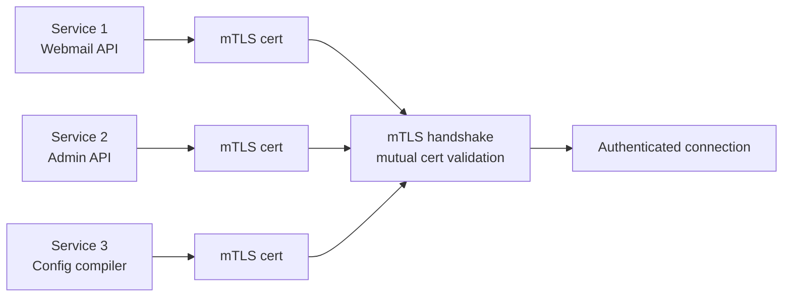

Config compiler provisions mTLS certificates to each service at bootstrap:
1. Each service generates a key pair and CSR
2. Config compiler signs CSR with internal CA
3. Certificate stored in service's secret store
4. Service reloads cert on renewal (automatic)

## Secrets management

### Secret types and storage

| Secret type | Storage | Rotation | Access |
|-------------|---------|----------|--------|
| PostgreSQL passwords | HashiCorp Vault / SSM Parameter Store | Config compiler injects at runtime | Config compiler, App |
| DKIM private keys | Vault / Kubernetes Secrets | Quarterly + domain transfer | MTA only |
| SMTP submission auth | LDAP/OIDC (external) | N/A | N/A |
| TLS certificates | ACME (Let's Encrypt) / Vault | Auto-renewal every 90 days | Config compiler |
| API keys (admin) | Vault / Kubernetes Secrets | On-rotate, 90-day expiry | Config compiler, App |
| Rspamd secrets | Vault / env vars (K8s) | Quarterly | Rspamd only |
| mTLS certificates | Internal CA (Vault) | Annual | Config compiler |
| Redis AUTH | Vault / env vars (K8s) | Quarterly | Config compiler |

### Vault integration

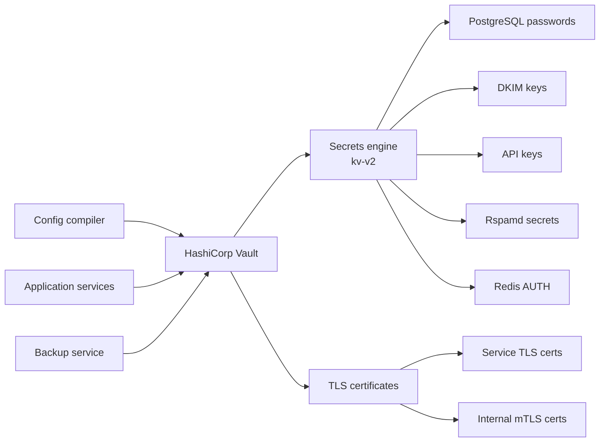

### Secret rotation policy

| Secret | Rotation interval | Method |
|--------|------------------|--------|
| PostgreSQL passwords | Config compiler on deploy | Inject at runtime |
| DKIM keys | Quarterly | Config compiler updates MTA config |
| API keys | 90 days or on-demand | Hash new key, deprecate old |
| TLS certificates | 90 days (ACME) | Auto-renewal via certbot |
| mTLS certificates | Annual | Config compiler provisions new certs |
| Redis AUTH | Quarterly | Config compiler updates Redis config |

### Security considerations

- **No plaintext secrets in config files**: Secrets are injected at runtime from Vault
- **No secrets in logs**: Secret values are never logged (masked or excluded)
- **No secrets in audit logs**: Audit events record *that* a secret was accessed, not *what* value
- **Secret access logging**: Every secret access is logged with timestamp, service, and reason
- **Least privilege**: Each service only accesses the secrets it needs

## Web application security

### CSRF protection

| Method | Where | Notes |
|--------|-------|-------|
| **CSRF tokens** | All state-changing forms | Single-use tokens, validated server-side |
| **SameSite cookies** | Session cookies | `SameSite=Strict` or `Lax` |
| **Origin/Referer checks** | All API calls | Validate Origin header matches allowed origins |
| **Double submit cookies** | Alternative to CSRF tokens | Cookie + header must match |

### XSS protection

| Method | Where | Notes |
|--------|-------|-------|
| **Content-Security-Policy** | All responses | Restrict script sources |
| **X-Content-Type-Options: nosniff** | All responses | Prevent MIME sniffing |
| **X-Frame-Options: DENY** | All responses | Prevent clickjacking |
| **Input sanitization** | All user input | Escape HTML, validate input format |
| **Output encoding** | All rendered content | Context-aware encoding (HTML, JS, URL) |

### Rate limiting

| Endpoint | Limit | Method |
|----------|-------|--------|
| Login | 10 attempts per IP per 5 minutes | Sliding window |
| Password reset | 5 requests per IP per hour | Sliding window |
| Admin API | 100 requests per minute per token | Token-based |
| IMAP login | 5 attempts per IP per 5 minutes | IP-based |
| SMTP submission | 100 emails per minute per account | Tenant-aware |
| Search | 50 queries per minute per account | Account-aware |

### Security headers

Every response includes:

```
X-Content-Type-Options: nosniff
X-Frame-Options: DENY
X-XSS-Protection: 1; mode=block
Content-Security-Policy: default-src 'self'; script-src 'self'; style-src 'self' 'unsafe-inline';
Strict-Transport-Security: max-age=31536000; includeSubDomains
Referrer-Policy: strict-origin-when-cross-origin
Permissions-Policy: camera=(), microphone=(), geolocation=()
```

## Data security

### Encryption at rest

| Data type | Encryption | Key management |
|-----------|-----------|----------------|
| PostgreSQL database | Transparent Data Encryption (TDE) | Database-managed or external KMS |
| Blob storage (S3) | Server-side encryption (SSE-S3/SSE-KMS) | S3-managed or customer-managed KMS |
| Redis | Optional (Redis Enterprise) | External KMS |
| Search index | Filesystem-level encryption | OS-managed |
| Backups | AES-256 | Customer-managed keys |

### Encryption in transit

| Channel | Protocol | Version |
|---------|----------|---------|
| Web UI → Browser | HTTPS/TLS | TLS 1.2+ (prefer 1.3) |
| Admin API → Browser | HTTPS/TLS | TLS 1.2+ (prefer 1.3) |
| SMTP → MTA | STARTTLS/TLS | TLS 1.2+ (prefer 1.3) |
| IMAP → MTA | STARTTLS/TLS | TLS 1.2+ (prefer 1.3) |
| Internal services | mTLS | TLS 1.2+ (prefer 1.3) |
| Backup → Remote | TLS 1.2+ | Configurable |
| S3 → Object store | HTTPS/TLS | TLS 1.2+ (prefer 1.3) |

### Email encryption (message-level)

| Method | Purpose | Implementation |
|--------|---------|----------------|
| **S/MIME** | End-to-end message encryption | Server certificate store + client integration |
| **PGP/MIME** | End-to-end message encryption | OpenPGP integration (GnuPG wrapper) |
| **TLS** | Hop-by-hop message encryption | MTA-level STARTTLS |

S/MIME support:
- Server validates and stores client certificates
- Outbound messages signed with sender's certificate
- Inbound messages verified against sender's certificate
- Decryption for incoming S/MIME encrypted messages (requires client certificate)

## Security audit logging

### Audit event model

All security-relevant events are logged to `AUDIT_EVENT`:

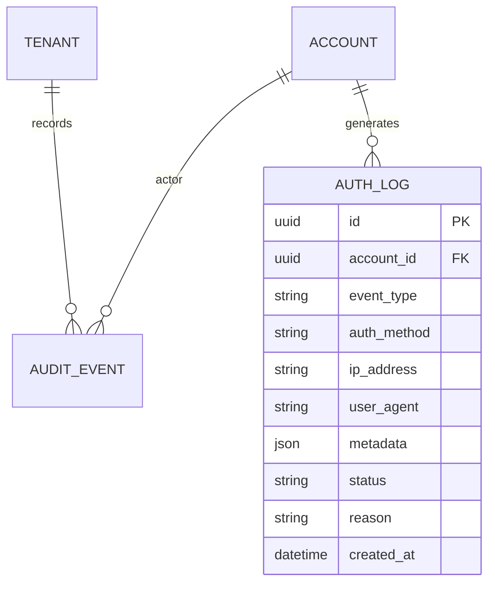

### Security audit event types

| Event type | Description | Logged by |
|-----------|-------------|-----------|
| `login.success` | Successful login | Auth service |
| `login.failure` | Failed login attempt | Auth service |
| `mfa.challenge` | MFA challenge issued | Auth service |
| `mfa.success` | MFA challenge passed | Auth service |
| `mfa.failure` | MFA challenge failed | Auth service |
| `mfa.enrolled` | User enrolled in MFA | Auth service |
| `session.created` | New session created | Auth service |
| `session.revoked` | Session revoked (user or admin) | Auth service |
| `app_password.generated` | New app password created | Auth service |
| `app_password.revoked` | App password revoked | Auth service |
| `password.changed` | Password changed | Auth service |
| `mfa.enabled` | MFA enabled for account | Admin API |
| `mfa.disabled` | MFA disabled for account | Admin API |
| `user.created` | New user created | Admin API |
| `user.deleted` | User deleted | Admin API |
| `policy.changed` | Policy changed | Admin API |
| `domain.created` | New domain created | Admin API |
| `domain.deleted` | Domain deleted | Admin API |
| `config.applied` | Config applied | Config compiler |
| `config.drift.detected` | Configuration drift detected | Drift detector |
| `backup.started` | Backup job started | Backup service |
| `backup.completed` | Backup job completed | Backup service |
| `backup.failed` | Backup job failed | Backup service |
| `tenant.suspended` | Tenant suspended | Admin API |
| `tenant.terminated` | Tenant terminated | Admin API |

### Audit log retention

| Event type | Retention | Storage |
|-----------|-----------|---------|
| Auth events (login, MFA, session) | 365 days | PostgreSQL + Loki |
| User management events | 10 years | PostgreSQL (immutable archive) |
| Policy changes | 10 years | PostgreSQL (immutable archive) |
| Config changes | 90 days | PostgreSQL + Loki |
| Backup events | 180 days | PostgreSQL + Loki |
| Tenant lifecycle events | 10 years | PostgreSQL (immutable archive) |

### Audit log access control

| Role | Can read | Can delete | Can modify |
|------|----------|-----------|-----------|
| Tenant admin | Tenant events only | No | No |
| Domain admin | Domain events only | No | No |
| Platform admin | All events | No | No |
| Security officer | All events | No | No |
| Audit log service | All events | No (immutable) | No |

## Security incident response

### Incident types and response

| Incident | Severity | Response time | Steps |
|----------|----------|---------------|-------|
| **Compromised account** | P1 | 1 hour | Revoke session → Reset password → Audit recent actions → Check for forwarding rules → Enable MFA |
| **Phishing campaign** | P1 | 2 hours | Quarantine messages → Analyze evidence → Update Rspamd rules → Notify affected tenants |
| **Malware delivery** | P2 | 4 hours | Quarantine messages → Analyze attachment → Update ClamAV signatures → Notify affected tenants |
| **Configuration drift** | P2 | 24 hours | Alert admin → Revert config → Investigate root cause → Update drift detection rules |
| **Backup failure** | P2 | 24 hours | Alert admin → Diagnose → Retry → Manual backup if automated fails |
| **DDoS attack** | P1 | 1 hour | Rate-limit affected IPs → Enable CDN/WAF → Notify upstream provider |
| **Data breach** | P0 | Immediate | Isolate affected tenant → Forensic analysis → Notify affected users → Legal compliance |
| **Ransomware** | P0 | Immediate | Isolate infrastructure → Activate DR plan → Restore from backup → Forensic analysis |

### Incident response workflow

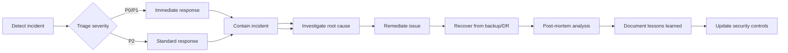

## Summary

The security model covers:

1. **Authentication**: OIDC/PKCE for web, app passwords for IMAP/DAV, OAuth 2.0 for third-party apps, mTLS for internal services
2. **MFA**: Per-account policy, TOTP/Push/WebAuthn/SMS fallback, trusted device management
3. **Session management**: TTLs, concurrent session limits, idle timeout, revocation at multiple levels
4. **API auth**: Scoped API keys, OAuth 2.0 access tokens, mTLS for internal services
5. **TLS**: ACME auto-renewal for external services, internal CA for mTLS
6. **Secrets**: HashiCorp Vault integration, injection at runtime, no plaintext in config files
7. **Data security**: Encryption at rest (TDE, S3 SSE), encryption in transit (TLS 1.2+)
8. **Web security**: CSRF protection, XSS prevention, security headers, rate limiting
9. **Audit logging**: Comprehensive event types, retention policies, access controls
10. **Incident response**: Defined severity levels, response times, and workflows

This model is enforced at the product layer (Admin API, Auth service, Config compiler) and leverages OSS components (Keycloak, Vault, Let's Encrypt) for underlying capabilities.
