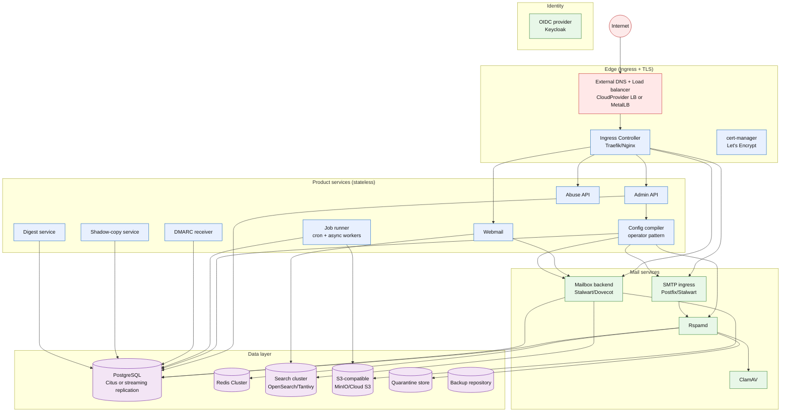
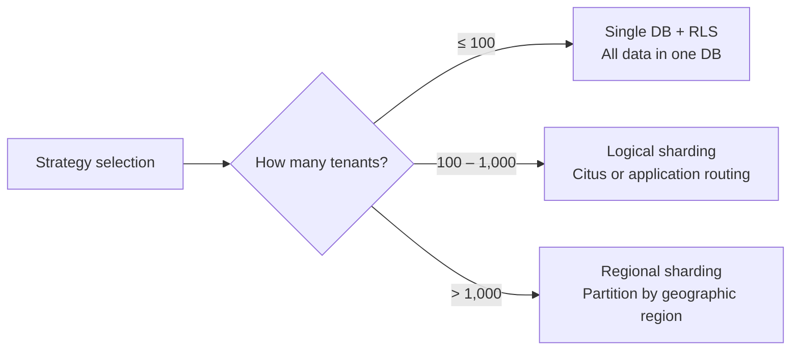
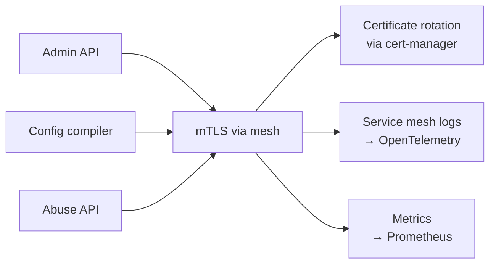

# 09 — Kubernetes Deployment Architecture

This document defines how Open Mailgroupware is deployed on Kubernetes, how
components shard as load grows, and how to operate at scale.

## Deployment phases

The platform has three deployment shapes, each with increasing sharding:

| Phase | Scale | K8s topology | Sharding strategy |
|-------|-------|-------------|-------------------|
| **Single-node MVP** | 1–100 tenants, 10K accounts | One cluster, single AZ | No sharding. All state in single instances. |
| **Multi-node production** | 100–1K tenants, 100K accounts | Multi-node cluster, multi-AZ | Per-tenant RLS for DB, Redis Cluster, search replicas, multiple SMTP nodes |
| **Multi-region enterprise** | 1K+ tenants, 1M+ accounts | Multi-region cluster | Geographic sharding, read replicas, per-region SMTP, CRDTs for state |

## Architecture overview



## Component deployment patterns

### Stateless services (Deployment + HPA)

| Service | Pattern | HPA target | Notes |
|---------|---------|-----------|-------|
| **Webmail** | Deployment | CPU 60%, memory 70% | Pure frontend, scales horizontally |
| **Admin API** | Deployment | CPU 60%, requests/second 1K | Stateless, session in Redis |
| **Abuse API** | Deployment | CPU 60%, requests/second 500 | Stateless, reads from PG |
| **DMARC receiver** | Deployment | CPU 60%, concurrent connections 100 | SMTP-based, connection-limited |
| **Shadow-copy** | Deployment | CPU 60% | Message pipeline, scales with volume |
| **Digest service** | Deployment | CPU 60% | Scheduled job, minimal concurrency |

### Stateful services (StatefulSet + operator)

| Service | Pattern | Scaling | Notes |
|---------|---------|---------|-------|
| **PostgreSQL** | Operator (Citus or PgBouncer pooler) | Sharding per tenant or read replicas | See sharding section |
| **Redis** | Redis Cluster operator | Add nodes, auto-shard keys | Key-prefix sharding for tenants |
| **Search** | OpenSearch/Tantivy operator | Add data nodes, index replicas | Tenant-scoped index partitions |
| **Mailbox backend** | Operator (Stalwart/Dovecot) | Multiple nodes, share blob | See mailbox scaling section |
| **Rspamd** | Operator | Horizontal pool | Shared Redis state |

### DaemonSet services (run on every node)

| Service | Purpose |
|---------|---------|
| **Node exporter** | Prometheus metrics |
| **Promtail** | Log shipping to Loki |
| **OpenTelemetry collector** | Trace and metric aggregation |
| **Config compiler agent** | Drift detection, config apply |

### CronJob services (scheduled)

| Job | Schedule | Purpose |
|-----|----------|---------|
| **Backup job** | Daily | Incremental + full backups |
| **Quarantine digest** | Daily/weekly | Compose and send user digests |
| **Training job** | Hourly | Process Junk/Not Junk feedback |
| **Tenant quota check** | Hourly | Monitor and enforce quotas |
| **DR failover test** | Monthly | Verify backup/restore procedures |
| **Certificate renewal** | Continuous | cert-manager handles automatically |

## Sharding strategies

### PostgreSQL sharding

The database is the most critical sharding point. Three strategies available:



#### Strategy 1: Flat DB with RLS (Phase 1)

Single PostgreSQL database. All queries scoped to `current_tenant_id`.

```yaml
apiVersion: postgresql.enterprises.databasesystem.com/v1
kind: Cluster
metadata:
  name: opengroupware-db
spec:
  instances: 1
  users:
    app:
      - databases:
        - opengroupware
  postgresql:
    parameters:
      shared_preload_libraries: 'pg_partman,pg_stat_statements'
  replicaCount: 2  # Standby for HA
```

Sharding considerations:
- RLS policies generated by config compiler
- Indexes on `tenant_id` for all tenant-scoped tables
- Connection pooling via PgBouncer in the same namespace
- Read replicas for read-heavy admin queries

```yaml
apiVersion: v1
kind: Service
metadata:
  name: pgbouncer
spec:
  type: ClusterIP
  ports:
  - port: 5432
    targetPort: 6432
---
apiVersion: apps/v1
kind: Deployment
metadata:
  name: pgbouncer
spec:
  replicas: 1
  selector:
    matchLabels:
      app: pgbouncer
  template:
    spec:
      containers:
      - name: pgbouncer
        image: edoburu/pgbouncer:latest
        ports:
        - containerPort: 6432
        configMapRef:
          name: pgbouncer-config
```

#### Strategy 2: Logical sharding with Citus (Phase 2)

Citus distributes tables across worker nodes. Tenant ID is the hash column.

```yaml
apiVersion: citus-data.com/v1
kind: Cluster
metadata:
  name: opengroupware-db
spec:
  instances: 3
  users:
    app:
      - databases:
        - opengroupware
  postgresql:
    version: "16"
    parameters:
      shared_preload_libraries: 'citus,pg_stat_statements'
```

Citus tables:

```sql
-- Tenant-scoped tables distributed by tenant_id
SELECT create_distributed_table('account', 'tenant_id');
SELECT create_distributed_table('domain', 'tenant_id');
SELECT create_distributed_table('mailbox', 'tenant_id');
SELECT create_distributed_table('message', 'tenant_id');
SELECT create_distributed_table('quarantine_item', 'tenant_id');

-- Shared tables replicated to all nodes
SELECT create_reference_table('tenant');
SELECT create_reference_table('tenant_resource_quota');
SELECT create_reference_table('admin_role');
SELECT create_reference_table('dns_record_requirement');

-- Local tables (not distributed, stored on primary node)
SELECT create_local_table('job', 'job', true);
SELECT create_local_table('job_event', 'job', true);
SELECT create_local_table('audit_event', 'tenant_id', true);
```

Citus benefits:
- Automatic sharding — no application changes needed
- Distributed queries work across shards
- Local table support for metadata
- Citus coordinator manages routing

Citus limits:
- Cross-shard joins are expensive
- DDL operations require cluster coordination
- More complex failover

#### Strategy 3: Regional sharding (Phase 3)

Each region has its own PostgreSQL cluster. Data is partitioned by geographic
region. Cross-region sync is eventual.

```
Region EU (eu-west-1):
  PostgreSQL Primary (eu-west-1a)
  PostgreSQL Standby (eu-west-1b)
  Region: Tenant A, Tenant B, Tenant C

Region US (us-east-1):
  PostgreSQL Primary (us-east-1a)
  PostgreSQL Standby (us-east-1b)
  Region: Tenant D, Tenant E, Tenant F

Global routing:
  DNS → nearest region
  Tenant routing table (admin API) → region assignment
```

### Redis sharding

#### Phase 1: Single Redis instance with Sentinel

```yaml
apiVersion: apps/v1
kind: StatefulSet
metadata:
  name: redis
spec:
  serviceName: redis
  replicas: 3
  selector:
    matchLabels:
      app: redis
  template:
    spec:
      containers:
      - name: redis
        image: redis:7-alpine
        command: ["redis-sentinel"]
        args: ["/etc/redis/sentinel.conf"]
        ports:
        - containerPort: 26379
  volumeClaimTemplates:
  - metadata:
      name: redis-data
    spec:
      accessModes: ["ReadWriteOnce"]
      resources:
        requests:
          storage: 50Gi
```

Key prefix convention enforced by application:

```
# Tenant-scoped keys
tenant:{tenant_id}:account:{account_id}:session
tenant:{tenant_id}:mailbox:{mailbox_id}:sync_token
tenant:{tenant_id}:quota:used_bytes
tenant:{tenant_id}:quarantine:pending
tenant:{tenant_id}:ratelimit:{ip}:{window}
tenant:{tenant_id}:abuse:score:{message_id}
tenant:{tenant_id}:policy:effective
```

#### Phase 2: Redis Cluster

```yaml
apiVersion: redis.opstreepubliccontainers.com/v1beta1
kind: RedisCluster
metadata:
  name: redis-cluster
spec:
  clusterSize: 6  # 3 masters + 3 replicas
  version: "7"
  storage:
    storageClassName: ssd
    accessModes:
    - ReadWriteOnce
    resources:
      requests:
        storage: 200Gi
```

Cluster-aware Redis client (Redisson or Lettuce):
- Key hash determines node assignment
- Application transparent — no code changes
- Automatic failover for individual shards

### Search sharding

#### OpenSearch/Tantivy approach

```yaml
apiVersion: apps/v1
kind: StatefulSet
metadata:
  name: opensearch
spec:
  serviceName: opensearch
  replicas: 5
  selector:
    matchLabels:
      app: opensearch
  template:
    spec:
      containers:
      - name: opensearch
        image: opensearchproject/opensearch:2.11
        env:
        - name: cluster.name
          value: "opengroupware-search"
        - name: discovery.seed_hosts
          value: "opensearch-0.opensearch.opensearch.svc.cluster.local,opensearch-1.opensearch.opensearch.svc.cluster.local,opensearch-2.opensearch.opensearch.svc.cluster.local"
        - name: cluster.initial_master_nodes
          value: "opensearch-0,opensearch-1,opensearch-2"
        - name: node.store.allow_mmap
          value: "true"
```

Index strategy:

```
# Per-tenant index (Phase 1 — small deployments)
tenant-a1b2c3d4e5f6-2026.07.15
tenant-a1b2c3d4e5f6-2026.07.16

# Per-region index (Phase 2 — large deployments)
eu-west-1-2026.07.15
us-east-1-2026.07.15

# Index template with tenant filter
{
  "index_patterns": ["*-2026.*"],
  "settings": {
    "index": {
      "number_of_shards": 3,
      "number_of_replicas": 1,
      "routing": {
        "allocation": {
          "include": {
            "tier": "data"
          }
        }
      }
    }
  },
  "mappings": {
    "properties": {
      "tenant_id": { "type": "keyword" },
      "mailbox_id": { "type": "keyword" },
      "subject": { "type": "text", "analyzer": "standard" },
      "from": { "type": "keyword" },
      "to": { "type": "keyword" },
      "received_at": { "type": "date" },
      "body": { "type": "text", "analyzer": "english" }
    }
  }
}
```

Query always includes tenant_id filter:
```
GET tenant-a1b2c3d4e5f6-2026.07.15/_search
{
  "query": {
    "bool": {
      "must": [{"match": {"body": "invoice"}}],
      "filter": [{"term": {"tenant_id": "a1b2c3d4-e5f6-..."}}]
    }
  }
}
```

### Mailbox backend sharding

#### Stalwart integration (Track A)

Stalwart supports multi-node with shared storage (S3-compatible):

```
Node 1 (eu-west-1a): Stalwart Primary
Node 2 (eu-west-1b): Stalwart Replica
Shared: S3 blob storage
Shared: PostgreSQL metadata (Citus-sharded)
Shared: Redis Cluster state
```

Scaling Stalwart:
- Read scale: Multiple replicas behind a load balancer
- Write scale: Single primary per region, cross-region replication
- Storage scale: S3 handles this automatically

#### Dovecot integration (Track B)

Dovecot needs shared storage for multi-node:

```
Node 1 (eu-west-1a): Dovecot Master
Node 2 (eu-west-1b): Dovecot Replica
Shared: NFS/Gluster/S3 for mailbox storage
Shared: PostgreSQL metadata (Citus-sharded)
Shared: Redis Cluster state
```

Dovecot multi-node pattern:
- Dovecot IMAP protocol with shared backend (NFS, Gluster, or S3 via s3fs)
- Master-replica topology: writes to primary, reads from replicas
- Dovecot LDA/LMTP on primary only
- IMAP connections load-balanced across nodes

### SMTP sharding

SMTP is the easiest to scale horizontally:

```
Phase 1: Single Postfix/Stalwart SMTP node
Phase 2: Multiple SMTP nodes behind DNS round-robin
Phase 3: Per-region SMTP pools
```

DNS configuration:
```
smtp.example.com.  IN  A  203.0.113.10
smtp.example.com.  IN  A  203.0.113.11
smtp.example.com.  IN  A  203.0.113.12
```

Each SMTP node is independent — same config (from config compiler), same
Rspamd backend (shared Redis), same mailbox backend (shared PostgreSQL + S3).

Config compiler ensures all nodes have identical configuration.

### Rspamd sharding

Rspamd is stateless with shared Redis:

```
Phase 1: Single Rspamd instance, shared Redis
Phase 2: Multiple Rspamd instances, Redis Cluster
Phase 3: Per-region Rspamd pools
```

Rspamd nodes share state via Redis:
- Bayes corpus in Redis (shared across all nodes)
- Rate limiting counters in Redis (shared across all nodes)
- Neural network data in Redis (shared across all nodes)
- Fuzzy hashes in Redis (shared across all nodes)

```yaml
apiVersion: apps/v1
kind: Deployment
metadata:
  name: rspamd
spec:
  replicas: 3
  selector:
    matchLabels:
      app: rspamd
  template:
    spec:
      containers:
      - name: rspamd
        image: rspamd/rspamd:latest
        env:
        - name: REDIS_SERVERS
          value: "redis-cluster:6379"  # Cluster mode
        resources:
          requests:
            cpu: "500m"
            memory: "1Gi"
          limits:
            cpu: "2"
            memory: "4Gi"
```

## Storage strategy

### PostgreSQL storage

| Phase | Storage | IOPS | Notes |
|-------|---------|------|-------|
| Single-node | EBS gp3 or local SSD | 3K | Single AZ, no replication |
| Multi-node | EBS gp3 or io2 | 10K+ | Multi-AZ replication via streaming |
| Enterprise | io2 provisioned | 100K+ | Per-tenant priority IOPS |

### Redis storage

| Phase | Storage | Size | Notes |
|-------|---------|------|-------|
| Single-node | EBS gp3 | 50Gi | Sentinels, no persistence beyond AOF |
| Multi-node | EBS gp3 per node | 200Gi | Redis Cluster, persistent AOF |
| Enterprise | EBS io2 per node | 500Gi | Redis Enterprise with memory management |

### Search storage

| Phase | Storage | Size | Notes |
|-------|---------|------|-------|
| Single-node | SSD local | 100Gi | Single node |
| Multi-node | SSD local per node | 200Gi per node | Index replicas |
| Enterprise | NVMe per node | 1Ti per node | Per-region indices |

### Blob storage

Blob storage is automatically distributed via S3-compatible backend. In-cluster:

```yaml
apiVersion: apps/v1
kind: StatefulSet
metadata:
  name: minio
spec:
  serviceName: minio
  replicas: 4
  selector:
    matchLabels:
      app: minio
  template:
    spec:
      containers:
      - name: minio
        image: minio/minio:latest
        args: ["server", "/data{1...4}", "--console-address", ":9001"]
        ports:
        - containerPort: 9000
        env:
        - name: MINIO_ROOT_USER
          valueFrom:
            secretKeyRef:
              name: minio-credentials
              key: access-key
        - name: MINIO_ROOT_PASSWORD
          valueFrom:
            secretKeyRef:
              name: minio-credentials
              key: secret-key
  volumeClaimTemplates:
  - metadata:
      name: data
    spec:
      accessModes: ["ReadWriteOnce"]
      resources:
        requests:
          storage: 500Gi
```

Or use cloud S3 (preferred for production):
```yaml
apiVersion: v1
kind: Secret
metadata:
  name: s3-credentials
stringData:
  access-key: "..."
  secret-key: "..."
```

Config compiler injects S3 endpoint into blob storage configuration for each
mailbox backend (Stalwart/Dovecot).

## Network topology and security

### K8s namespace structure

```
Namespaces:
  opengroupware-system  — Infrastructure components (DB, cache, search)
  opengroupware-product  — Product services (AdminAPI, ConfigCompiler, etc.)
  opengroupware-mail    — Mail services (SMTP, Rspamd, ClamAV, Mailbox)
  opengroupware-identity — Identity services (OIDC, LDAP)
  opengroupware-monitoring — Monitoring (Prometheus, Grafana, Loki)
  opengroupware-backup   — Backup operations
```

Each namespace is isolated via NetworkPolicy:

```yaml
apiVersion: networking.k8s.io/v1
kind: NetworkPolicy
metadata:
  name: allow-from-ingress
  namespace: opengroupware-product
spec:
  podSelector: {}
  ingress:
  - from:
    - namespaceSelector:
        matchLabels:
          name: opengroupware-system
    - podSelector:
        matchLabels:
          app: ingress-controller
  policyTypes:
  - Ingress
---
apiVersion: networking.k8s.io/v1
kind: NetworkPolicy
metadata:
  name: allow-from-product-to-data
  namespace: opengroupware-system
spec:
  podSelector:
    matchLabels:
      app: postgresql
  ingress:
  - from:
    - namespaceSelector:
        matchLabels:
          name: opengroupware-product
    - namespaceSelector:
        matchLabels:
          name: opengroupware-mail
  policyTypes:
  - Ingress
---
apiVersion: networking.k8s.io/v1
kind: NetworkPolicy
metadata:
  name: deny-all
  namespace: opengroupware-system
spec:
  podSelector: {}
  ingress:
  - from:
    - namespaceSelector:
        matchLabels:
          name: opengroupware-product
    - namespaceSelector:
        matchLabels:
          name: opengroupware-mail
  - from:
    - namespaceSelector:
        matchLabels:
          name: opengroupware-monitoring
  policyTypes:
  - Ingress
```

### Service mesh for mTLS



Linkerd or Istio for internal service communication:
- Automatic mTLS between all pods
- Certificate rotation via cert-manager
- Traffic encryption for all inter-service communication
- Observability (request tracing, metrics)
- Canary deployments (traffic splitting)

### Ingress configuration

Traefik ingress for HTTP/HTTPS routing:

```yaml
apiVersion: traefik.containo.us/v1alpha1
kind: IngressRoute
metadata:
  name: webmail
  namespace: opengroupware-product
spec:
  entryPoints:
  - websecure
  routes:
  - match: Host(`webmail.example.com`)
    services:
    - name: webmail
      port: 8080
  tls:
    secretName: webmail-tls-cert
---
apiVersion: traefik.containo.us/v1alpha1
kind: IngressRoute
metadata:
  name: admin
  namespace: opengroupware-product
spec:
  entryPoints:
  - websecure
  routes:
  - match: Host(`admin.example.com`)
    services:
    - name: admin-api
      port: 8080
  tls:
    secretName: admin-tls-cert
```

## Configuration management via operator pattern

The config compiler becomes a Kubernetes operator:

```
Operator loop:
  1. Watch CustomResourceDefinition (TCR — Tenant Config Request)
  2. TCR created by Admin API when tenant/domain/user changes
  3. Config compiler reconciles: desired → generated → applied
  4. Drift detector watches live configs
  5. On drift: alert + auto-reconcile
```

Custom Resource Definition:

```yaml
apiVersion: apiextensions.k8s.io/v1
kind: CustomResourceDefinition
metadata:
  name: tenantconfigs.opengroupware.io
spec:
  group: opengroupware.io
  versions:
  - name: v1
    served: true
    storage: true
    schema:
      openAPIV3Schema:
        type: object
        properties:
          spec:
            type: object
            properties:
              tenant_id:
                type: string
                format: uuid
              domain:
                type: string
              domain_admin:
                type: string
              policy_profile:
                type: string
              smtp_config:
                type: object
              rspamd_config:
                type: object
              mailbox_config:
                type: object
          status:
            type: object
            properties:
              applied_at:
                type: string
                format: date-time
              status:
                type: string
                enum: ["pending", "applying", "applied", "failed"]
              errors:
                type: string
              last_synced_config:
                type: string
  scope: Namespaced
  names:
    plural: tenantconfigs
    singular: tenantconfig
    kind: TenantConfig
```

Config compiler operator:

```yaml
apiVersion: apps/v1
kind: Deployment
metadata:
  name: config-compiler-operator
spec:
  replicas: 2
  selector:
    matchLabels:
      app: config-compiler-operator
  template:
    spec:
      serviceAccountName: config-compiler-sa
      containers:
      - name: operator
        image: opengroupware/config-compiler:latest
        command: ["config-compiler", "operator"]
        env:
        - name: CONFIG_RECONCILE_INTERVAL
          value: "10s"
        - name: DRIFT_CHECK_INTERVAL
          value: "30s"
        resources:
          requests:
            cpu: "200m"
            memory: "256Mi"
          limits:
            cpu: "1"
            memory: "512Mi"
---
apiVersion: rbac.authorization.k8s.io/v1
kind: ClusterRole
metadata:
  name: config-compiler-operator
rules:
- apiGroups: ["opengroupware.io"]
  resources: ["tenantconfigs", "tenantconfigs/status"]
  verbs: ["get", "list", "watch", "update"]
- apiGroups: [""]
  resources: ["configmaps", "secrets", "pods"]
  verbs: ["get", "list", "watch", "update", "patch"]
```

## Scaling strategies by component

### Horizontal scaling (HPA)

Stateless services scale automatically based on CPU, memory, and custom metrics:

```yaml
apiVersion: autoscaling/v2
kind: HorizontalPodAutoscaler
metadata:
  name: admin-api
spec:
  scaleTargetRef:
    apiVersion: apps/v1
    kind: Deployment
    name: admin-api
  minReplicas: 2
  maxReplicas: 50
  metrics:
  - type: Resource
    resource:
      name: cpu
      target:
        type: Utilization
        averageUtilization: 60
  - type: Resource
    resource:
      name: memory
      target:
        type: Utilization
        averageUtilization: 70
  - type: Pods
    pods:
      metric:
        name: requests-per-second
      target:
        type: Value
        averageValue: 1000
  behavior:
    scaleUp:
      stabilizationWindowSeconds: 30
      policies:
      - type: Percent
        value: 50
        periodSeconds: 60
    scaleDown:
      stabilizationWindowSeconds: 300
      policies:
      - type: Percent
        value: 10
        periodSeconds: 120
```

### Vertical scaling (VPA)

Stateful services scale vertically:

```yaml
apiVersion: autoscaling.k8s.io/v1
kind: VerticalPodAutoscaler
metadata:
  name: opensearch
spec:
  targetRef:
    apiVersion: apps/v1
    kind: StatefulSet
    name: opensearch
  updatePolicy:
    updateMode: "Auto"
  resourcePolicy:
    containerPolicies:
    - containerName: opensearch
      minAllowed:
        cpu: "1"
        memory: "4Gi"
      maxAllowed:
        cpu: "16"
        memory: "64Gi"
```

### Node pool strategy

```yaml
# Three node pools for different workload types:
Node pool "general":   — Product services, web, admin API
Node pool "mail":      — SMTP, Rspamd, ClamAV, Mailbox backend
Node pool "data":      — PostgreSQL, Redis, Search (high IOPS, persistent storage)
```

Node pool configuration:
```yaml
# Kubernetes NodePool (cluster-autoscaler)
apiVersion: node.k8s.io/v1
kind: NodePool
metadata:
  name: data
spec:
  template:
    spec:
      nodeSelector:
        workload: data
      tolerations:
      - key: node-role.kubernetes.io/data
        operator: Exists
      resources:
        limits:
          ephemeral-storage: "1000Gi"
  configuration:
    minSize: 3
    maxSize: 20
    scaleUpMode: MostAllocated
```

## Disaster recovery and backup

### Backup strategy

```
Backup layers:
  1. PostgreSQL: pgBackRest (full + incremental + continuous WAL archiving)
  2. Redis: Redis RDB snapshots + AOF
  3. Blob/S3: Cross-region replication
  4. Config: GitOps (config compiler outputs → Git repository)
  5. Search: Snapshot API (OpenSearch)
```

pgBackRest in K8s:

```yaml
apiVersion: postgresqlenterprises.com/v1
kind: Cluster
metadata:
  name: opengroupware-db
spec:
  instances:
    - name: "1"
      replicas: 2
  backups:
    postgresql:
      barmanObjectStore:
        destinationPath: "s3://backup-bucket/opengroupware-db"
        serverName: "opengroupware"
        s3Credentials:
          id:
            name: backup-s3-credentials
            key: access-key
          secret:
            name: backup-s3-credentials
            key: secret-key
        retentionentionPolicy: "RETENTION REDUNDANCY 2"
        retentionRestorePointOpt: "RETENTION RESTORE POINTS FOR 30 DAYS"
```

### Restore procedures

| Component | Restore command | Time estimate |
|-----------|----------------|---------------|
| PostgreSQL | pgBackRest restore + WAL replay | 15 min per 100 GB |
| Redis | RDB file load + AOF replay | 5 min per 50 GB |
| Blob/S3 | Cross-region restore or S3 select | 1 min per 1 TB (parallel) |
| Search | OpenSearch snapshot restore | 30 min per 100 GB |
| Config | Git checkout + operator reconcile | Instant (reconcile takes minutes) |

### DR failover

```
Normal operation:
  Primary cluster (eu-west-1) → All traffic
  DR cluster (us-east-1) → Warm standby, DB replication active

Failover:
  1. Detect failure (health check timeout, alert)
  2. Promote DR cluster (PostgreSQL streaming standby → primary)
  3. Update DNS (Route53 failover, Cloudflare fallback)
  4. Reconnect config compiler to DR cluster
  5. Notify all services to reconnect to DR endpoints
  6. Verify service health
  7. Resume normal operations

Failback:
  1. Once primary cluster is healthy
  2. Re-establish replication (DR → Primary)
  3. Update DNS to point to Primary
  4. Verify Primary accepts traffic
  5. Drain DR cluster connections
  6. Resume normal operations
```

## Monitoring and observability

### Metrics collection

```
Prometheus collects:
  - Pod metrics (CPU, memory, file descriptors, goroutines)
  - Service metrics (request rate, error rate, latency p50/p95/p99)
  - Database metrics (connections, queries, replication lag)
  - Redis metrics (hit rate, memory, connected clients)
  - Search metrics (indexing rate, search latency)
  - SMTP metrics (messages/sec, queue depth, bounce rate)
  - Config compiler metrics (reconcile rate, drift count, config apply errors)
```

```yaml
apiVersion: monitoring.coreos.com/v1
kind: ServiceMonitor
metadata:
  name: opengroupware
spec:
  selector:
    matchLabels:
      app.kubernetes.io/managed-by: opengroupware
  namespaceSelector:
    matchNames:
    - opengroupware-product
    - opengroupware-mail
    - opengroupware-identity
  endpoints:
  - port: metrics
    interval: 15s
```

### Alert rules

```yaml
apiVersion: monitoring.coreos.com/v1
kind: PrometheusRule
metadata:
  name: opengroupware-alerts
spec:
  groups:
  - name: opengroupware
    rules:
    - alert: DatabaseReplicationLag
      expr: pg_stat_replication_restart_lag_seconds > 60
      for: 5m
      labels:
        severity: critical
      annotations:
        summary: "PostgreSQL replication lag > 60s"
    - alert: SMTPQueueBacklog
      expr: opengroupware_smtp_queue_depth > 10000
      for: 10m
      labels:
        severity: warning
      annotations:
        summary: "SMTP queue depth > 10K messages"
    - alert: ConfigDriftDetected
      expr: opengroupware_config_drift_count > 0
      for: 1m
      labels:
        severity: warning
      annotations:
        summary: "Configuration drift detected"
    - alert: TenantQuotaExceeded
      expr: opengroupware_tenant_quota_used_bytes / opengroupware_tenant_quota_max_bytes > 0.95
      for: 1h
      labels:
        severity: warning
      annotations:
        summary: "Tenant quota usage > 95%"
    - alert: RspamdBayesTrainingStuck
      expr: opengroupware_rspamd_training_jobs_pending > 1000
      for: 30m
      labels:
        severity: warning
      annotations:
        summary: "Rspamd training jobs backed up"
    - alert: HighEmailBounceRate
      expr: rate(opengroupware_smtp_bounce_total[5m]) / rate(opengroupware_smtp_sent_total[5m]) > 0.05
      for: 15m
      labels:
        severity: critical
      annotations:
        summary: "Email bounce rate > 5%"
```

### Dashboards

Key dashboards:
1. **Platform overview** — health, traffic, error rates, tenant count
2. **Mail delivery** — SMTP throughput, queue depth, bounce rate, spam score distribution
3. **Database** — connections, queries, replication lag, disk usage
4. **Cache** — Redis hit/miss ratio, memory, connected clients
5. **Search** — indexing rate, search latency, index size
6. **Config compiler** — reconcile rate, drift count, apply errors
7. **Per-tenant** — resource usage, quota, email volume, abuse score

## Migration paths

### From single-node to multi-node

```
Phase 1 → Phase 2 migration steps:

1. Deploy multi-node cluster (add nodes, AZs)
2. Add PgBouncer to PostgreSQL (transparent to app)
3. Deploy Redis Cluster (migrate keys with redis-trib)
4. Deploy OpenSearch multi-node cluster (migrate indices)
5. Deploy second SMTP node (config compiler distributes config)
6. Deploy second mailbox node (shared storage)
7. Deploy second Rspamd node (shared Redis state)
8. Enable cross-region replication for blob storage
9. Test failover with pg_auto_failover
10. Update DNS for load balancing
```

### From multi-node to multi-region

```
Phase 2 → Phase 3 migration steps:

1. Deploy second cluster in new region
2. Set up PostgreSQL logical replication (Citus → Citus)
3. Set up S3 cross-region replication
4. Deploy regional SMTP pools in each region
5. Configure DNS with latency-based routing
6. Migrate tenants one region at a time (admin API controlled)
7. Enable per-region resource quotas
8. Deploy regional config compiler operators
9. Test cross-region failover
10. Decommission legacy single-region setup
```

## Summary

Kubernetes deployment for Open Mailgroupware follows these principles:

1. **Stateless services** scale horizontally with HPA (webmail, admin API, abuse API, etc.)
2. **Stateful services** use operators for PostgreSQL, Redis, search, and mailbox backends
3. **Data sharding** scales from single DB + RLS → Citus logical sharding → regional sharding
4. **Config compiler** is an operator that watches tenant configs and drives config distribution
5. **Network isolation** via K8s NetworkPolicies between namespaces
6. **Internal mTLS** via service mesh (Linkerd/Istio) for all inter-service communication
7. **Monitoring** via Prometheus, Grafana, Loki, and OpenTelemetry
8. **Backup** via pgBackRest, Redis RDB, S3 cross-region replication, and GitOps config
9. **DR** via warm-standby second cluster with automated failover

The growth path is linear: add nodes → add replicas → add regions. Each phase is
a natural extension of the previous one, with minimal application changes.
